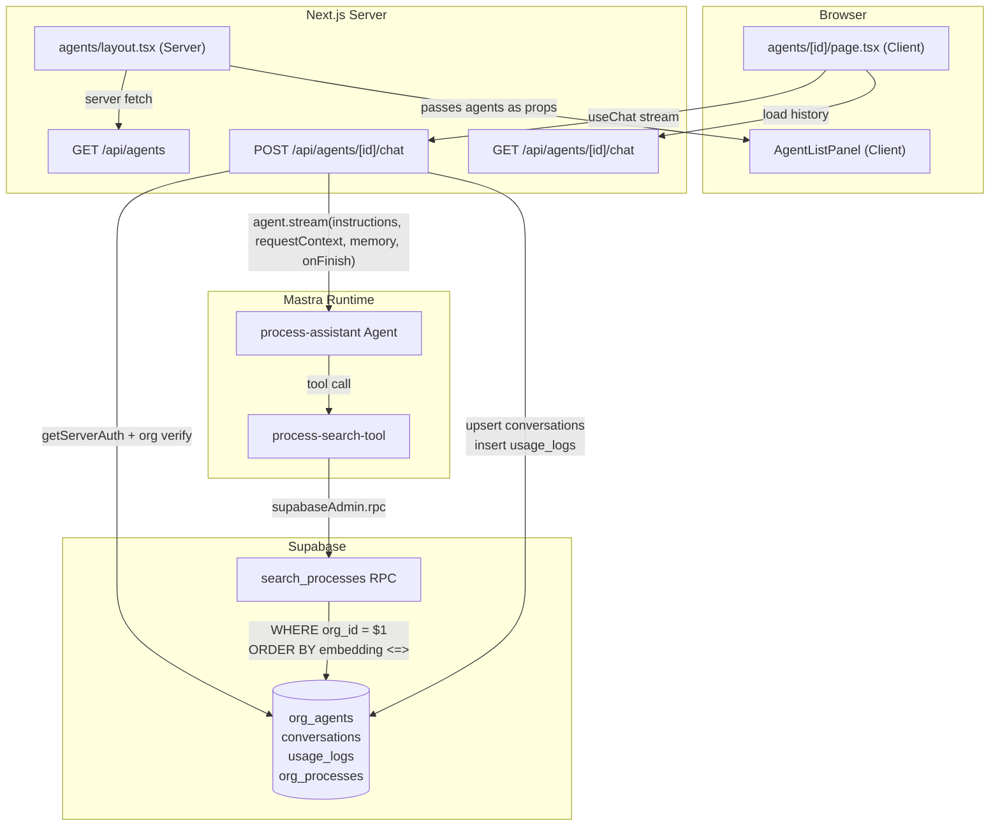

<!-- ---
title: "Building the agents core of Jenjco: RAG, multi-tenancy, and two bugs I didn't see coming"
slug: jenjco-01-agents-core
series: Building Jenjco
seriesIndex: 1
date: 2026-04-18
description: "A case study of shipping the first real feature of Jenjco — a multi-tenant AI process assistant — covering pgvector RAG, Mastra agents with tool-scoped request context, and two production-shaped bugs that taught me more than the happy path."
tags: [mastra, nextjs, supabase, pgvector, rag, ai-sdk, typescript]
cover: /images/blog/jenjco-01-cover.png
--- -->

## Building the agents core of Jenjco: RAG, multi-tenancy, and two bugs I didn't see coming

This is a case study of one feature, not a tutorial. The repo is private, so you can't clone and run it end-to-end — but I'll share enough code, diagrams, and decisions that the *ideas* are portable to any Next.js + Mastra + Supabase stack.

It's also the first post in a series. I'm documenting Jenjco's build publicly as a way to sharpen my own thinking and, hopefully, save someone else a few hours when they hit the same walls.

> **Series:** Building Jenjco — Post 1 of N.
>
> **Last verified against:** `@mastra/core@1.24.1`, `@mastra/memory@1.15.0`, `@mastra/pg@1.9.0`, `@mastra/ai-sdk@1.3.3`, `@ai-sdk/openai@3.0.53`, `ai@6.0.156`, Next.js 16.1.7. Mastra's APIs move fast — if you're reading this six months from now, cross-check the [Mastra docs](https://mastra.ai/docs).

---

## What Jenjco is, in one paragraph

[Jenjco](https://jenjco.com) is a multi-tenant internal-operations platform where each client organisation gets a set of AI agents and workflows configured against *their own* business processes, data, and people. Starting out as a consultancy-as-platform, we will be scoping our clients, using a traditional consultancy approach, building out custom agents and workflows, and deploying them to the Jenjco platform.

Under the hood that's a Next.js 16 app, Supabase for auth + Postgres (with `pgvector` for embeddings), and [Mastra](https://mastra.ai) as the agent runtime. This post is about the first feature that makes the whole thing real: letting a signed-in user pick an agent from their org's roster and have a grounded conversation with it.

## What's in scope (and what isn't)

In scope for this post:

- The Postgres + `pgvector` schema slice that powers org-scoped retrieval
- The Mastra agent, tool, and `requestContext` pattern that keeps tenants isolated
- The `/api/agents/[id]/chat` route that wires auth, memory, streaming, and usage logging into one handler
- The split-panel chat UI built on [`ai-elements`](https://ai-sdk.dev/docs/ai-sdk-ui)
- **Two bugs** that ate a day of debugging: a Supabase pooler exhaustion crash, and a Mastra Studio silent-failure that turned my tool's fallback logic into dead code

Out of scope (possibly future posts):

- Auth, middleware, and the `(dashboard)` route group — built in the [earlier bootstrap phase](#series-context)
- Workflows, the audit page, the org-structure diagram — later phases
- The process-editing CRUD — read-only for now

## Architecture at a glance



Four layers: a browser that streams tokens from a Next.js route handler, which in turn calls a Mastra agent, which calls a tool, which calls a Supabase Postgres function. Every hop either enforces tenant isolation or hands off the `orgId` to the next layer that does.

The rest of the post unpacks the interesting parts of that diagram.

---

## The knowledge base: `pgvector` + a `SECURITY DEFINER` RPC

Each client org has a library of written-down processes ("how we onboard a new hire", "how we close the month", etc.). Each row in `org_processes` gets an `embedding vector(1536)` column populated by OpenAI's `text-embedding-3-small`. OpenAI's text-embedding is used for the bootstrap, this may be subject to change in the future.

Initialiatising RAG with pgvector. The cleanest way to enforce that is to push both the filter and the distance sort into a single Postgres function that only trusted server-side code can call.

```sql
CREATE OR REPLACE FUNCTION public.search_processes(
  query_embedding vector(1536),
  org_id_filter uuid,
  match_count int DEFAULT 5
)
RETURNS TABLE (id uuid, title text, content text, similarity float)
LANGUAGE sql STABLE SECURITY DEFINER
AS $$
  SELECT id, title, content,
         1 - (embedding <=> query_embedding) AS similarity
  FROM public.org_processes
  WHERE org_id = org_id_filter
    AND embedding IS NOT NULL
  ORDER BY embedding <=> query_embedding
  LIMIT match_count;
$$;
```

`SECURITY DEFINER` is the sealed envelope here: the function carries its owner's privileges regardless of who invokes it, so it can bypass Row-Level Security cleanly. That's only safe because `org_id_filter` is **always** supplied by our own server-side code, never by a browser request body.

Implementing using the [Supabase postgres-best-practices skill](https://supabase.com/docs) and [pgvector docs](https://github.com/pgvector/pgvector).

## Generating embeddings with the AI SDK

Mastra's model router (`"openai/gpt-5-mini"` for chat) doesn't handle embedding models, so the AI SDK's `embed` function is called directly:

```typescript
// lib/embeddings.ts
import { openai } from '@ai-sdk/openai'
import { embed } from 'ai'

export async function generateEmbedding(text: string): Promise<number[]> {
  const { embedding } = await embed({
    model: openai.embedding('text-embedding-3-small'),
    value: text,
  })
  return embedding
}
```

Used in two places: the seed script (to backfill embeddings for the demo processes) and inside the search tool at query time.

---

## The agent, the tool, and the "injection" pattern


The key design question: **how does the agent's tool know which org it's searching on behalf of, without letting the LLM choose?**

If we added `orgId` to the tool's `inputSchema`, the model would be technically capable of fabricating, omitting, or leaking it. Anything a model can *see*, it can also *lie about*. The LLM is a contractor; you don't hand it the keys to your house. It asks for what it needs via `inputSchema`, and the building (the server) quietly injects the address (`orgId`) separately.

Mastra's `RequestContext` is exactly that separate channel:

```typescript
// src/mastra/tools/process-search-tool.ts (trimmed)
export const processSearchTool = createTool({
  id: 'process-search',
  description: 'Search internal business processes by semantic similarity...',
  inputSchema: z.object({
    query: z.string().describe('The user question or search phrase'),
  }),
  outputSchema: z.object({ /* ... */ }),
  requestContextSchema: z.object({
    orgId: z.string().uuid().optional(),
  }),
  execute: async ({ query }, context) => {
    const orgId = context?.requestContext?.get('orgId')
      ?? process.env.MASTRA_STUDIO_ORG_ID   // fallback for local Mastra Studio
    if (!orgId) throw new Error('orgId missing from requestContext')

    const embedding = await generateEmbedding(query)
    const supabase = createAdminClient()
    const { data, error } = await supabase.rpc('search_processes', {
      query_embedding: embedding,
      org_id_filter: orgId,
      match_count: 5,
    })
    if (error) throw error
    return { results: data ?? [] }
  },
})
```

`createAdminClient()` uses the service-role key (not a user session) — because the tool runs inside Mastra, outside any user's auth cookie. That's fine and safe because the only path to `org_id_filter` is the `requestContext` set by our authenticated API route. Authorisation is enforced one layer up; the tool is the privileged executor.

The agent itself is small.

```typescript
// src/mastra/agents/process-assistant.ts
export const processAssistantAgent = new Agent({
  id: 'process-assistant',
  name: 'Process Assistant',
  instructions: `You help users find and follow internal business processes.
When the user asks about any process, procedure, or "how do I...",
always call the process-search tool first. ...`,
  model: 'openai/gpt-5-mini',
  tools: { processSearchTool },
  memory: new Memory({ storage: getMastraStorage() }),
})
```

The `memory` + shared `PostgresStore` is important, and directly connected to [Bug 1](#bug-1-max-client-connections-reached) below.

---

## The chat route: five jobs in sequence

The POST handler at `app/api/agents/[id]/chat/route.ts` is the only place in the system where *every* constraint meets:

1. **Authentication** — who is this user?
2. **Authorisation** — does this agent actually belong to this user's org?
3. **Conversation upsert** — so the left-hand panel can show "last active" timestamps.
4. **Stream** with `instructions`, `requestContext`, `memory`, `onFinish`.
5. **Usage logging** — tokens in/out, cost estimate, for the audit page (later post).

Trimmed to the essentials:

```typescript
export async function POST(req: Request, { params }: { params: Promise<{ id: string }> }) {
  const { id: orgAgentId } = await params
  const { appUser } = await getServerAuth()
  if (!appUser) return NextResponse.json({ error: 'Unauthorized' }, { status: 401 })

  const supabase = await createClient()
  const { data: orgAgent } = await supabase
    .from('org_agents')
    .select('id, agent_key, system_prompt_override, is_active')
    .eq('id', orgAgentId)
    .eq('org_id', appUser.orgId)  // org verify
    .single()
  if (!orgAgent) return NextResponse.json({ error: 'Agent not found' }, { status: 404 })

  const { messages } = await req.json()
  const threadId = `${appUser.orgId}-${appUser.id}-${orgAgentId}`

  // ... upsert conversations row ...

  const requestContext = new RequestContext<{ orgId: string }>()
  requestContext.set('orgId', appUser.orgId)

  const mastra = getMastra()
  const agent = mastra.getAgentById(orgAgent.agent_key)
  const stream = await agent!.stream(messages, {
    instructions: orgAgent.system_prompt_override ?? undefined,
    requestContext,
    memory: { thread: threadId, resource: appUser.id },
    onFinish: async (result) => {
      await logUsage({
        orgId: appUser.orgId, userId: appUser.id,
        agentKey: orgAgent.agent_key,
        tokensIn: result.usage?.inputTokens ?? 0,
        tokensOut: result.usage?.outputTokens ?? 0,
      })
    },
  })

  return createUIMessageStreamResponse({
    stream: toAISdkStream(stream, { from: 'agent' }) as Parameters<
      typeof createUIMessageStreamResponse
    >[0]['stream'],
  })
}
```

A few decisions worth flagging:

- **`agent.stream()` over Mastra's higher-level `handleChatStream` helper.** We need direct access to `instructions` (org-specific system-prompt overrides), `requestContext` (the injection channel), `memory` (for thread scoping), and `onFinish` (for usage logging). Those four need to co-exist, so the lower-level API is the right fit.
- **`threadId = ${orgId}-${userId}-${orgAgentId}`.** Deterministic and org-partitioned. Two users in the same org chatting with the same agent get separate threads; the same user coming back later gets their history.

The matching `GET` handler rehydrates history from Mastra memory with `memory.recall({ threadId, resourceId })` and shapes it with `toAISdkV5Messages`, so the client's `useChat` picks up where the user left off.

## The UI: split panel, email-client style

Two files do most of the work:

- `app/(dashboard)/agents/layout.tsx` — **Server Component**. Fetches the agent list once per navigation, renders a left sidebar + `{children}` on the right.
- `features/agents/components/agent-list-panel.tsx` — **Client Component**. Owns the search input and highlights the active segment with `useSelectedLayoutSegment()`.

The chat page (`app/(dashboard)/agents/[id]/page.tsx`) is a direct lift of the earlier single-agent chat page with three tweaks:

- The endpoint is dynamic: `apiPaths.agentChat(id)`
- Conversation history is loaded on mount via the `GET` handler
- The layout fills the available panel height (`h-full`) instead of grabbing `h-screen`

The mental model is the classic email-client layout: left panel stays mounted, right panel swaps. This plays nicely with Next.js route groups — navigating from `/agents/a` to `/agents/b` only re-renders the right side, because the layout is a parent segment.

---

## Bug 1: "Max client connections reached" {#bug-1-max-client-connections-reached}

### Symptoms

- Mastra Studio chat popped a toast: `MastraClientError: HTTP error! status: 500 - {"error":"Max client connections reached"}`.
- Repeated 500s on `/memory/threads`, `/memory/threads/:id/working-memory`, and `/agents/:id/stream`.
- The stack trace always bottomed out in `@mastra/observability`'s `_ObservabilityPG.init`.

```
Error: Max client connections reached
  at PgDB.createTable (@mastra/pg)
  at async _ObservabilityPG.init (@mastra/pg)
  at async Promise.all (index 3)
  at async PostgresStore.init (@mastra/core)
  at async PostgresStore.init (@mastra/pg)
```

### Root cause

The error string isn't from Postgres — it's from Supabase's Supavisor pooler, hit when `max_client_conn` is exhausted. Three things were stacking:

**1. Multiple `pg.Pool` instances per Mastra runtime.** `PostgresStore` opens its own pool. `@mastra/observability`'s `DefaultExporter` spins up an internal pool (`_ObservabilityPG`). With `PostgresStore`'s default `max: 20`, a single fresh Mastra instance was holding ~30+ connections open before doing any work.

**2. HMR pool leaks in dev.** Every `next dev` / `mastra:dev` save re-evaluated `src/mastra/index.ts`, which constructed a *new* `Mastra` + `PostgresStore`.

**3. An incidental debug `fetch` inside the Mastra proxy's `get` trap** that fired on every property access.
### Fix

Move the storage to its own module and cache it on `globalThis` so HMR reuses it. Cap `max` small because `PostgresStore` fans out into ~14 sibling sub-stores that all share this pool:

```typescript
// src/mastra/storage.ts
declare global {
  // eslint-disable-next-line no-var
  var __mastraPgStore: PostgresStore | undefined
}

function createMastraStorage(): PostgresStore {
  const connectionString = process.env.DATABASE_URL
  if (!connectionString) throw new Error("DATABASE_URL is not set...")
  return new PostgresStore({
    id: "mastra-storage",
    connectionString,
    schemaName: "mastra",
    max: 5,
    idleTimeoutMillis: 10_000,
  })
}

export function getMastraStorage(): PostgresStore {
  if (!globalThis.__mastraPgStore) {
    globalThis.__mastraPgStore = createMastraStorage()
  }
  return globalThis.__mastraPgStore
}
```

Then the `Mastra` singleton itself gets the same treatment in `src/mastra/index.ts`. The proxy's debug `fetch` goes away. The agent's `Memory` is constructed with the shared store rather than a fresh one.

Same pattern is documented in `@mastra/pg`'s own Next.js guide.

### Operational takeaways

- Use Supabase's **Transaction Pooler** host (port `6543`) for `DATABASE_URL` in dev and serverless. Its `max_client_conn` ceiling is much higher than the direct `db.<ref>.supabase.co:5432` endpoint.
- After applying a fix like this, **fully kill** any stale `mastra:dev` / `next dev` processes before restarting. Leaked pools from earlier runs keep holding pooler slots for a minute or two before Supabase reaps them.
- Watch **Supabase Dashboard → Database → Pooler**. Active client connections should sit low and flat, not climb with each save.

---

## Bug 2: the agent that could talk but couldn't read {#bug-2-mastra-studio-silent-failure}

### Symptoms

- Seeded `org_processes` rows existed with valid 1536-dim embeddings — I'd checked in the Supabase SQL editor.
- Chatting with the agent in Mastra Studio (`pnpm mastra:dev`) always produced some variation of:

  > "I tried to look up your org's process list but couldn't access the internal process database (tool returned a context/permission error)."

- The explicit `throw new Error("orgId missing: ... set MASTRA_STUDIO_ORG_ID ...")` I'd put in the tool's `execute()` was **never** thrown. Neither was the debug `console.log` at the top of `execute()`. 

That last detail is the key. If the tool were being *called* and failing, I'd see logs. If the tool was not being called at all, the agent wouldn't fabricate something as specific as "context/permission error". The only scenario that fits both observations is the tool being almost called but short-circuited before `execute()` — and the agent receiving a structured error in place of a result.

### Root cause

I'd declared a strict `requestContextSchema`:

```ts
const processSearchRequestContextSchema = z.object({
  orgId: z.string().uuid(),  // required!
})
```

Per `@mastra/core`'s docs: when you define `requestContextSchema` on a tool, the context is validated **before** `execute()` runs. Tools don't throw on validation failure — they short-circuit and return:

```json
{ "error": true, "message": "Request context validation failed for process-search..." }
```

The app path sets `orgId` from `getServerAuth()`, so validation passes. But **Mastra Studio doesn't populate `requestContext`** by default — it just lets you chat. So in Studio:

1. Agent decides to call `process-search`.
2. Mastra runs `requestContextSchema.parse({})` → fails (`orgId: Required`).
3. Mastra short-circuits and returns the validation-error object.
4. The model sees `{ error: true, message: "...context validation failed..." }` and paraphrases it as "context/permission error".

The `MASTRA_STUDIO_ORG_ID` env-var fallback I'd added inside `execute()` was dead code, because `execute()` was never being reached.

### Fix

Relax the schema so `orgId` as optional, and let the runtime resolution (request context first, env var second) inside `execute()` decide:

```ts
const processSearchRequestContextSchema = z.object({
  orgId: z.string().uuid().optional(),
})
```

App path is unaffected (`RequestContext` is still populated). Studio falls through to the env var. Everyone's happy.

### Alternatives I considered

- **Remove `requestContextSchema` entirely.** Functionally equivalent. I kept the schema because the validation is still useful for catching bugs in my own server code.
- **Run Studio with `--request-context-presets ./presets.json`.** Keeps the strict schema and provides `orgId` via a Studio dropdown.

### The lesson

Framework-provided validation can turn your own guard code into dead code without warning you. Two defensive habits came out of this:

1. When a tool "fails silently", suspect validation layers running above your `execute()` before suspecting your own code.
2. Don't put two fallback mechanisms at two different layers (schema + `execute()`). One or the other. If the outer one rejects, the inner one never runs.

---

## Series context 

This post stands on top of an earlier **Bootstrap** phase I haven't written up yet: the Supabase schema, RLS policies, auth middleware, dashboard shell, seed script, and the storage swap from LibSQL/DuckDB to `@mastra/pg`. 

## Links and references

- [Mastra docs](https://mastra.ai/docs) · [`@mastra/core` reference](https://mastra.ai/reference/core) · [`RequestContext`](https://mastra.ai/reference/server/request-context)
- [AI SDK `embed()`](https://ai-sdk.dev/docs/reference/ai-sdk-core/embed) · [`useChat`](https://ai-sdk.dev/docs/reference/ai-sdk-ui/use-chat) · [`createUIMessageStreamResponse`](https://ai-sdk.dev/docs/reference/ai-sdk-ui/create-ui-message-stream-response)
- [Supabase pgvector guide](https://supabase.com/docs/guides/ai/vector-columns) · [Supavisor pooler](https://supabase.com/docs/guides/database/connecting-to-postgres#connection-pooler) · [RLS + `SECURITY DEFINER`](https://supabase.com/docs/guides/database/functions)
- [pgvector](https://github.com/pgvector/pgvector)
- [AI Elements](https://ai-sdk.dev/docs/ai-sdk-ui) — the UI primitives used in the chat page

If you spot something wrong or just want to compare notes, I'd love to hear from you — [email](mailto:eliott.c.h.byrnes@googlemail.com).

---

*Last verified against: `@mastra/core@1.24.1`, `@mastra/memory@1.15.0`, `@mastra/pg@1.9.0`, `@mastra/ai-sdk@1.3.3`, `@ai-sdk/openai@3.0.53`, `ai@6.0.156`, Next.js 16.1.7, Node.js ≥22.13.0. Published 2026-04-18.*
