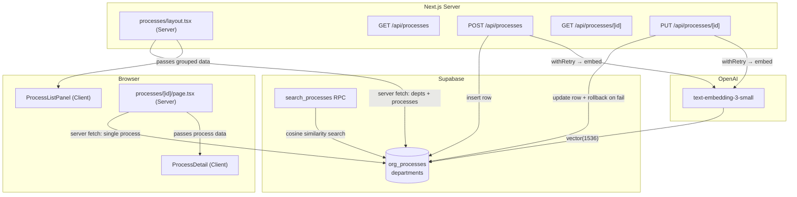
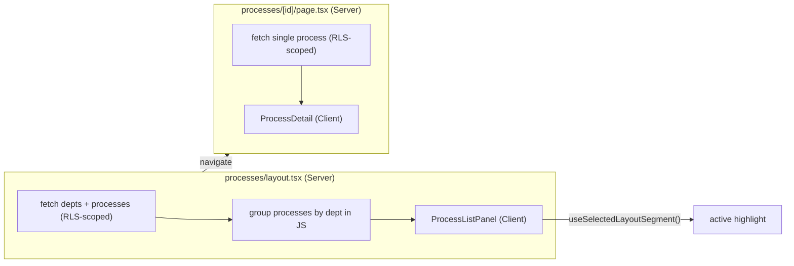

## Building Jenjco's knowledge base
> **Series:** Building Jenjco — Post 2 of N.
>
> **Last verified against:** Next.js 16.1.7, `streamdown@0.8.x`, `@streamdown/code@0.8.x`, Supabase JS v2, `@ai-sdk/openai@3.0.53`. Streamdown's plugin API evolves quickly — cross-check the [Streamdown docs](https://github.com/streamdown/streamdown) if you're reading this later.

This is post 2 in the [Building Jenjco](#series-context) series. [Post 1](jenjco-01-agents-core) covered the agent runtime, RAG retrieval, and the `requestContext` injection pattern. This post covers Phase 4: the Processes feature — a knowledge-base UI where users can browse and read their org's written-down business processes, and admins can create and update them via API.

It's less dramatic than the bug-heavy first post, but there's one problem I didn't anticipate that's worth writing down: how do you keep your database consistent when a row must exist before you can generate its embedding?

---

## What's in scope

- The `search_processes` Postgres RPC (the last piece of the RAG pipeline from post 1)
- The API routes (`GET` list, `POST` create, `GET` detail, `PUT` update) with role-based access control
- The **atomic embedding problem** and the rollback strategies for `POST` vs `PUT`
- [Streamdown](https://github.com/streamdown/streamdown) as the markdown renderer — why it's the right choice here even though the content isn't streamed
- The split-panel layout and how `useSelectedLayoutSegment()` handles active highlighting without client-side state

Out of scope:

- The agents feature and RAG pipeline — covered in [post 1](jenjco-01-agents-core)
- The admin UI for creating processes (the API exists; the form is post-MVP)
- Chunked embeddings for long documents (noted as a post-MVP concern throughout)

## Architecture at a glance



The read path (layout + detail page) is entirely server-side: data is fetched in Server Components, passed as props, and rendered in the browser. The write path (POST and PUT) runs in route handlers that gate on `appUser.role === 'admin'` and use the service-role client to bypass RLS.

---

## The `search_processes` RPC

Post 1 described the Mastra tool that calls `supabase.rpc("search_processes", ...)`. What I hadn't shipped yet was the actual SQL function. It's the last piece of the RAG pipeline, and without it the Process Assistant agent throws the moment a user asks it anything.

```sql
CREATE OR REPLACE FUNCTION search_processes(
  query_embedding vector(1536),
  org_id_filter   uuid,
  match_count      int DEFAULT 5
)
RETURNS TABLE (
  id         uuid,
  title      text,
  content    text,
  similarity float
)
LANGUAGE sql STABLE
AS $$
  SELECT
    id,
    title,
    content,
    1 - (embedding <=> query_embedding) AS similarity
  FROM org_processes
  WHERE org_id = org_id_filter
    AND embedding IS NOT NULL
  ORDER BY embedding <=> query_embedding
  LIMIT match_count;
$$;
```

`<=>` is pgvector's cosine distance operator. Subtracting from 1 gives similarity (1 = identical, 0 = orthogonal). The `AND embedding IS NOT NULL` guard matters because rows can exist without embeddings during the brief window between insertion and embedding generation — which brings us to the most interesting design problem in this phase.

---

## The atomic embedding problem

The `org_processes` table has an `embedding vector(1536)` column. The embedding is what makes the row retrievable by the RAG search tool. Without it, the process exists in the database but is invisible to the agent.

Here's the constraint: you need the row's `id` before you can call OpenAI to generate the embedding. You can't insert and embed atomically — one has to happen first. The naive sequence is:

1. Insert the row (get an `id` back)
2. Call OpenAI to generate the embedding
3. Update the row with the embedding

Steps 1 and 3 are database operations. Step 2 is an external HTTP call. If step 2 or 3 fails, you're left with a row that the search tool skips (`AND embedding IS NOT NULL`) but that clutters the list view and breaks the UI link to a detail page.

The `withRetry` wrapper handles transient OpenAI failures (3 attempts, exponential backoff at 1s, 2s):

```typescript
// lib/with-retry.ts
export async function withRetry<T>(
  fn: () => Promise<T>,
  attempts = 3
): Promise<T> {
  let lastError: unknown
  for (let i = 0; i < attempts; i++) {
    try {
      return await fn()
    } catch (err) {
      lastError = err
      if (i === attempts - 1) throw err
      await new Promise((r) => setTimeout(r, 1000 * 2 ** i))
    }
  }
  throw lastError instanceof Error ? lastError : new Error('withRetry: unreachable')
}
```

But retries don't solve permanent failures (network outage, quota exhausted, malformed input). For those, the two write handlers need different rollback strategies.

### POST: delete the orphaned row

A newly created row has no prior state. If embedding fails after all retries, the cleanest thing is to delete the row that was just inserted and return a 500. No orphan, no partial state.

```typescript
// app/api/processes/route.ts (trimmed)
const { data: inserted } = await admin
  .from('org_processes')
  .insert({ org_id, department_id, title, slug, content, updated_at: now })
  .select('id, ...')
  .single()

try {
  const embedding = await withRetry(() => generateEmbedding(`${title}\n\n${content}`))
  await admin.from('org_processes').update({ embedding }).eq('id', inserted.id)
} catch {
  await admin.from('org_processes').delete().eq('id', inserted.id)
  return NextResponse.json({ error: 'Failed to generate embedding' }, { status: 500 })
}

return NextResponse.json(inserted, { status: 201 })
```

### PUT: restore from a snapshot

An update is trickier. The row already has an old embedding that works. Overwriting `title`/`content` and then failing to regenerate the embedding leaves the content and embedding out of sync — the search tool will return this process for queries that match the old text, but display the new text.

The fix is to snapshot the original values before making any changes, and restore from the snapshot if embedding fails:

```typescript
// app/api/processes/[id]/route.ts (trimmed)
const snapshot = {
  title: existing.title,
  content: existing.content,
  department_id: existing.department_id,
  updated_at: existing.updated_at,
}

// Apply the requested changes
await admin.from('org_processes')
  .update({ title, content, department_id, updated_at: now })
  .eq('id', processId)
  .eq('org_id', appUser.orgId)

try {
  const embedding = await withRetry(() => generateEmbedding(`${title}\n\n${content}`))
  await admin.from('org_processes').update({ embedding }).eq('id', processId)
} catch {
  // Restore previous state so content and embedding stay in sync
  await admin.from('org_processes').update(snapshot).eq('id', processId)
  return NextResponse.json({ error: 'Failed to generate embedding' }, { status: 500 })
}
```

The content rollback isn't perfect — there's still a window between the content update and the rollback where the data is inconsistent. A proper solution would use a Postgres transaction or a write-ahead log. For the MVP, with no concurrent admin writes in the roadmap, the snapshot pattern is good enough.

### Embedding text format

One small decision: embed `${title}\n\n${content}` rather than content alone. This mirrors what the seed script does and improves retrieval quality — when a user asks "how do we onboard new staff?", the title "Employee Onboarding" is in the embedding. If the format later needs to change, you'd re-embed all rows, which is a bulk update job — another post-MVP item.

---

## The API routes: admin gating and validation

Both write handlers (`POST /api/processes`, `PUT /api/processes/[id]`) follow the same pattern:

1. `getServerAuth()` → check user exists
2. `appUser.role !== 'admin'` → 403 Forbidden
3. Parse body with Zod, return 400 on failure
4. Validate `department_id` belongs to the user's org (prevents cross-org department assignment)
5. Perform the DB write, then generate/update the embedding
6. Return result or roll back on embedding failure

The `GET` handlers use `createClient()` (RLS-scoped, respects the signed-in user's session) while the write handlers use `createAdminClient()` (service-role key, bypasses RLS). This is the same split used in the chat route from post 1: reads go through the user's session, writes that need to touch multiple rows or bypass policies go through the admin client.

The `PUT` body schema uses a `.refine()` to require at least one field, which is a nicer constraint than separate routes or a PATCH:

```typescript
const putBodySchema = z
  .object({
    title: z.string().min(1).optional(),
    content: z.string().optional(),
    department_id: z.string().uuid().optional(),
  })
  .refine(
    (b) => b.title !== undefined || b.content !== undefined || b.department_id !== undefined,
    { message: 'At least one of title, content, department_id is required' }
  )
```

---

## Streamdown: static markdown in a streaming-optimised renderer

Each process document is a Markdown string. The obvious choice is `react-markdown`, but Jenjco already uses Streamdown for the agent chat UI and it's a better fit even for static content.

Streamdown is designed for LLM streaming — it renders incrementally as tokens arrive without layout thrash. For static content you just pass `mode="static"` and it renders all at once. You get syntax highlighting (Shiki), clean prose styles, and consistent rendering between the agent chat and the process documents without pulling in two Markdown renderers.

```bash
pnpm add streamdown @streamdown/code
```

Tailwind v4 scans source files for class names. Streamdown and its plugins ship compiled JS, so the dist paths need to be added to `app/globals.css`:

```css
@source "../node_modules/streamdown/dist/*.js";
@source "../node_modules/@streamdown/code/dist/*.js";
```

The `ProcessDetail` component is a client component — Streamdown uses Shiki for syntax highlighting, which loads a WASM binary in the browser. `mode="static"` doesn't mean "runs on the server":

```tsx
// features/processes/components/process-detail.tsx
'use client'

import { code } from '@streamdown/code'
import { Streamdown } from 'streamdown'

export function ProcessDetail({ process, role }: { process: ProcessDetailData; role: AppRole }) {
  return (
    <div className="flex h-full w-full min-h-0 flex-col">
      <header className="shrink-0 space-y-3 border-b px-6 py-5">
        <div className="flex flex-wrap items-start justify-between gap-3">
          <h1 className="text-xl font-semibold tracking-tight">{process.title}</h1>
          {role === 'admin' && (
            <div className="flex shrink-0 gap-2">
              {/* Edit / Delete buttons — disabled stubs for MVP */}
            </div>
          )}
        </div>
        <p className="text-sm text-muted-foreground">
          {process.departmentName ?? '—'}
          <span className="mx-2 text-border">·</span>
          Updated {formatUpdatedAt(process.updatedAt)}
        </p>
      </header>
      <div className="min-h-0 flex-1 overflow-y-auto px-6 py-6">
        <Streamdown mode="static" plugins={{ code }}>
          {process.content}
        </Streamdown>
      </div>
    </div>
  )
}
```

The `min-h-0` on the scroll container is the standard Flexbox fix for nested overflow: a flex item's minimum height defaults to `auto` (its content height), which prevents `overflow-y-auto` from activating until you force `min-h-0`. Something I have to look up every time.

---

## The split-panel layout

The processes feature mirrors the agents layout exactly. This is intentional — the email-client pattern (persistent left panel, swappable right panel) is Jenjco's standard shell for list-detail features.




### Server Component layout

`processes/layout.tsx` is a Server Component. It runs two queries (departments, then processes) and groups them in JavaScript before passing the result to the client panel. This keeps the client component free of data-fetching logic.

```typescript
// app/(dashboard)/processes/layout.tsx
const { data: depts } = await supabase
  .from('departments').select('id, name, sort_order')
  .eq('org_id', appUser.orgId).order('sort_order')

const { data: processes } = await supabase
  .from('org_processes').select('id, title, department_id, slug')
  .eq('org_id', appUser.orgId).order('title')

const grouped = (depts ?? []).map((d) => ({
  ...d,
  processes: (processes ?? []).filter((p) => p.department_id === d.id),
}))
```

Two separate queries and a client-side grouping, rather than a single join with Postgres grouping. For the expected data sizes (tens of processes per org), this is fine, and it's simpler to type.

### Active highlight without client state

`ProcessListPanel` uses `useSelectedLayoutSegment()` to know which process is currently open. The segment is the UUID in `/processes/[id]`, so comparing it against each process's `id` gives the active state without any `useState` or URL parsing:

```typescript
const activeSegment = useSelectedLayoutSegment()
// in each row:
isSelected={process.id === activeSegment}
```

This is the same trick used in `AgentListPanel`. Because the layout is a parent route segment, navigating between processes only re-renders the right panel — the left panel stays mounted and `useSelectedLayoutSegment()` updates reactively.

### Department accordion

Each department section is a shadcn `Collapsible`. The "Operations" department from the seed opens by default; others start collapsed:

```tsx
<Collapsible defaultOpen={department.name === 'Operations'}>
```

Hardcoded to the seed department name for now. A more robust approach would persist open/closed state to `localStorage`, or use a `sort_order === 0` convention. Post-MVP.

### Zero-padding the shell

`dashboard-shell.tsx` strips padding from the main area on agents routes so the split panel fills edge-to-edge. Processes needs the same treatment:

```typescript
function isProcessesRoute(pathname: string | null): boolean {
  if (!pathname) return false
  return pathname === '/processes' || pathname.startsWith('/processes/')
}

const nopadding = isAgentsRoute(pathname) || isProcessesRoute(pathname)
```

Without this, there's a gap around the split panel that breaks the edge-to-edge layout.

---

## The token limit note

`text-embedding-3-small` accepts up to ~~8,191 tokens (6,000 words). The seed processes are short documents, so this isn't a live problem — but it's the kind of constraint that's easy to forget and hard to debug later (the API silently truncates rather than erroring). It's documented in a JSDoc on `generateEmbedding` and in a comment next to each `withRetry(() => generateEmbedding(...))` call in the route handlers:

```typescript
// MVP: text-embedding-3-small accepts up to ~8,191 tokens (~6,000 words); excess is
// silently truncated by the API. Post-MVP: chunked embedding — see generateEmbedding JSDoc.
const embedding = await withRetry(() => generateEmbedding(`${title}\n\n${content}`))
```

Chunking — splitting a long document on headings, embedding each chunk separately, storing multiple rows per process, aggregating at retrieval time — is the standard post-MVP pattern.

---

## What I'd do differently

**Transactions for the POST path.** The delete-on-failure rollback works, but it's not atomic. A Postgres function that inserts the row, calls `pg_net` or an edge function to generate the embedding, and updates in one transaction would be cleaner. Overkill for the MVP, but worth noting.

`**slug` as the URL key.** The `slug` column is populated by the seed and by `slugForNewProcess()` on creation, but URL routing uses UUIDs (`/processes/[id]`). Slugs are human-readable and SEO-friendly. For now, UUIDs are simpler — no slug uniqueness constraint, no redirect-on-rename logic. If processes ever get public URLs, slugs would be worth the plumbing.

**Persistent sidebar state.** The accordion open/closed state resets on navigation. Storing it in `localStorage` or a URL search param would improve the experience. Deferred because the current behaviour is acceptable and the fix adds client-side complexity.

---

## Series context

This is the second post in the series. [Post 1](jenjco-01-agents-core) covered the agent runtime, multi-tenant RAG, and the Supabase pooler bug. The earlier **Bootstrap** phase (Supabase schema, RLS policies, auth middleware, dashboard shell, seed script) hasn't been written up yet — it'll appear as a retroactive post at some point.

## Links and references

- [Streamdown](https://github.com/streamdown/streamdown) · `[@streamdown/code](https://github.com/streamdown/streamdown/tree/main/packages/code)`
- [pgvector operators](https://github.com/pgvector/pgvector#querying) — `<=>` cosine distance
- [Supabase pgvector guide](https://supabase.com/docs/guides/ai/vector-columns)
- [Next.js `useSelectedLayoutSegment](https://nextjs.org/docs/app/api-reference/functions/use-selected-layout-segment)`
- [shadcn Collapsible](https://ui.shadcn.com/docs/components/collapsible)
- [Tailwind v4 `@source` directive](https://tailwindcss.com/docs/detecting-classes-in-source-files)

If you spot something wrong or want to compare notes — [email](mailto:eliott.c.h.byrnes@googlemail.com).

---

*Last verified against: Next.js 16.1.7, `streamdown@0.8.x`, `@streamdown/code@0.8.x`, Supabase JS v2, `@ai-sdk/openai@3.0.53`, `ai@6.0.156`. Published 2026-05-01.*