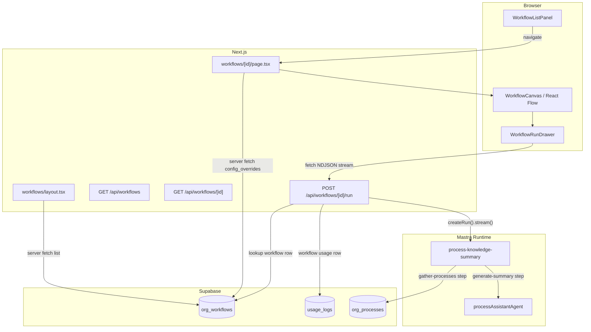
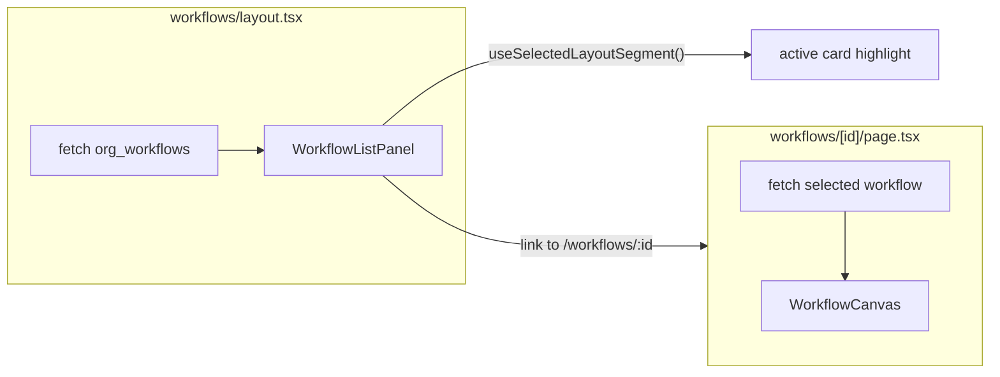

## Visualising Jenjco's first workflow
> **Series:** Building Jenjco - Post 3 of N.
>
> **Last verified against:** Next.js 16.1.7, `@mastra/core@1.24.1`, `@mastra/pg@1.9.0`, `@xyflow/react@12.10.2`, `streamdown@2.5.0`, `@streamdown/code@1.1.1`, Supabase JS v2, `ai@6.0.156`. Mastra workflow APIs move quickly - cross-check the [Mastra docs](https://mastra.ai/docs) if you're reading this later.

This is post 3 in the Building Jenjco series. [Post 1](jenjco-01-agents-core) covered the agent runtime, multi-tenant RAG, and request-scoped tool context. [Post 2](02-processes-knowledge-base.md) covered the Processes knowledge base, including the embedding lifecycle and the split-panel document UI.

This post covers Phase 5: Workflows. The goal was to replace the placeholder workflow screen with a useful educational workflow experience: users can browse workflows assigned to their organisation, inspect the steps on a read-only canvas, and admins can run a workflow while watching each step update in real time.

The interesting problem in this phase wasn't writing the three-step demo workflow. It was deciding where workflow display metadata should live, and how much of Mastra's runtime stream should leak into the product UI.

---

## What's in scope

- The `process-knowledge-summary` Mastra workflow
- The `org_workflows.config_overrides` JSON shape used to draw workflow steps and inputs
- The `/api/workflows` routes, including an admin-only streaming run endpoint
- The move from `usage_logs.agent_key` to a generic `resource_key` / `resource_type`
- The split-panel `/workflows` UI, React Flow canvas, and run drawer
- The stream parser that maps Mastra workflow events to node status colours

Out of scope:

- A workflow builder. Workflows are still code-defined in Mastra.
- Durable background execution. Runs are request-scoped for the MVP.
- Fine-grained token accounting for workflow runs. Phase 5 logs workflow usage, but records `0` input/output tokens for now.
- Arbitrary graph layout. The first workflow is linear, so the layout is deliberately simple.

## Architecture at a glance



The page follows the same shape as Agents and Processes: a Server Component layout fetches the left panel data, a nested Server Component fetches the selected record, and client components handle search, canvas rendering, and run state.

The run path is the only unusual piece. `POST /api/workflows/[id]/run` starts a Mastra workflow run and returns a newline-delimited JSON stream. The drawer consumes that stream line-by-line and updates the canvas state as events arrive.

---

## The first workflow: summarise the knowledge base

The demo workflow is intentionally small:

1. Validate the input contains an `orgId`.
2. Gather all process documents for that organisation.
3. Ask the Process Assistant agent to summarise them into a knowledge overview.

```typescript
const processKnowledgeSummaryWorkflow = createWorkflow({
  id: "process-knowledge-summary",
  inputSchema: z.object({ orgId: z.string().uuid() }),
  outputSchema: z.object({ summary: z.string() }),
})
  .then(validateInput)
  .then(gatherProcesses)
  .then(generateSummary)

processKnowledgeSummaryWorkflow.commit()
```

The `gather-processes` step uses the admin Supabase client because the workflow runs on behalf of an authenticated org user but needs a clean server-side read of all process documents in that org:

```typescript
const gatherProcesses = createStep({
  id: "gather-processes",
  description: "Retrieves all process documents for the org",
  inputSchema: z.object({ orgId: z.string() }),
  outputSchema: z.object({ processes: z.string(), orgId: z.string() }),
  execute: async ({ inputData }) => {
    const { createAdminClient } = await import("@/lib/supabase/admin")
    const supabase = createAdminClient()
    const { data } = await supabase
      .from("org_processes")
      .select("title, content")
      .eq("org_id", inputData.orgId)

    const text = (data ?? [])
      .map((p) => `## ${p.title}\n${p.content ?? ""}`)
      .join("\n\n---\n\n")

    return { processes: text || "No processes found.", orgId: inputData.orgId }
  },
})
```

The last step reuses the existing Process Assistant agent instead of creating a separate summariser agent:

```typescript
const generateSummary = createStep({
  id: "generate-summary",
  description: "Uses the Process Assistant agent to generate a knowledge summary",
  inputSchema: z.object({ processes: z.string(), orgId: z.string() }),
  outputSchema: z.object({ summary: z.string() }),
  execute: async ({ inputData, mastra }) => {
    const agent = mastra?.getAgent("processAssistantAgent")
    if (!agent) {
      throw new Error("processAssistantAgent not found in Mastra registry")
    }

    const response = await agent.generate([
      {
        role: "user",
        content: `Summarise these business processes into a clear knowledge overview:\n\n${inputData.processes}`,
      },
    ])

    return { summary: response.text }
  },
})
```

This is not the final shape of Jenjco workflows. It's a first product-facing workflow that proves the path from org configuration, to runtime execution, to UI feedback.

---

## The metadata problem

Mastra workflows are code-defined. That's good for correctness: steps have schemas, execution order is explicit, and TypeScript can help catch mistakes.

But the UI needs different information:

- Step labels
- Short descriptions
- Edges between steps
- Input fields to show in the run drawer
- A stable order for canvas layout

I did not want the app to depend on runtime introspection of Mastra internals for this. Even if some metadata can be inspected today, it is not a product contract I want the UI coupled to during the MVP.

So Phase 5 stores the UI-facing workflow metadata on the org workflow row:

```json
{
  "steps": [
    {
      "id": "validate-input",
      "label": "Validate Input",
      "description": "Schema validation"
    },
    {
      "id": "gather-processes",
      "label": "Gather Processes",
      "description": "Retrieve process docs"
    },
    {
      "id": "generate-summary",
      "label": "Generate Summary",
      "description": "AI-generated content"
    }
  ],
  "edges": [
    { "source": "validate-input", "target": "gather-processes" },
    { "source": "gather-processes", "target": "generate-summary" }
  ],
  "inputSchema": {
    "type": "object",
    "properties": {
      "orgId": {
        "type": "string",
        "description": "Your organisation ID (pre-filled)"
      }
    },
    "required": ["orgId"]
  }
}
```

This does create duplication: the step IDs live in both code and database JSON. For the MVP, that's the right trade. The runtime definition remains the source of execution truth; `config_overrides` is display configuration.

The canvas parser treats this JSON as untrusted input:

```typescript
function parseWorkflowConfig(raw: unknown): {
  steps: StepMeta[]
  edges: EdgeMeta[]
  inputSchema?: Record<string, unknown>
} {
  if (!raw || typeof raw !== 'object') return { steps: [], edges: [] }
  const o = raw as Record<string, unknown>
  const steps: StepMeta[] = []
  const edges: EdgeMeta[] = []

  if (Array.isArray(o.steps)) {
    for (const s of o.steps) {
      if (!s || typeof s !== 'object') continue
      const r = s as Record<string, unknown>
      const id = typeof r.id === 'string' ? r.id : null
      if (!id) continue
      steps.push({
        id,
        label: typeof r.label === 'string' ? r.label : id,
        description: typeof r.description === 'string' ? r.description : '',
      })
    }
  }

  // edges and inputSchema follow the same defensive parsing pattern
}
```

That is less elegant than a perfect schema validator, but it keeps a malformed config row from crashing the whole workflow detail page.

---

## Extending usage logs beyond agents

Before Phase 5, usage rows were agent-specific:

```sql
agent_key text
```

Workflows need to be logged too, so the column was renamed and a discriminator added:

```sql
ALTER TABLE public.usage_logs
  RENAME COLUMN agent_key TO resource_key;

ALTER TABLE public.usage_logs
  ADD COLUMN resource_type text NOT NULL DEFAULT 'agent'
  CHECK (resource_type IN ('agent', 'workflow'));
```

The logger now accepts a generic resource:

```typescript
export async function logUsage({
  orgId, userId, resourceKey, resourceType = 'agent', tokensIn, tokensOut,
}: {
  orgId: string
  userId: string
  resourceKey: string
  resourceType?: 'agent' | 'workflow'
  tokensIn: number
  tokensOut: number
}) {
  const supabase = await createClient()
  const costEstimate = (tokensIn * 0.00015 + tokensOut * 0.0006) / 1000
  await supabase.from('usage_logs').insert({
    org_id: orgId,
    user_id: userId,
    resource_key: resourceKey,
    resource_type: resourceType,
    tokens_in: tokensIn,
    tokens_out: tokensOut,
    cost_estimate: costEstimate,
  })
}
```

Agent chat calls still omit `resourceType`, so they default to `agent`. Workflow runs pass `resourceType: "workflow"`.

One caveat: the workflow run currently records `tokensIn: 0` and `tokensOut: 0`. That is honest but incomplete. The step that calls `agent.generate()` has usage information available lower down the stack, but this phase did not add a reliable aggregation path from nested agent calls back to the route handler. For now, usage logging captures that a workflow ran, not what it cost.

---

## The streaming run endpoint

The run route is admin-only. Viewers can inspect workflow definitions, but only admins can execute them:

```typescript
const { appUser } = await getServerAuth()
if (!appUser) {
  return NextResponse.json({ error: "Unauthorized" }, { status: 401 })
}
if (appUser.role !== "admin") {
  return NextResponse.json({ error: "Forbidden" }, { status: 403 })
}
```

It also validates the workflow ID, scopes the database lookup to the user's org, and refuses inactive workflows:

```typescript
const { data: wf, error: wfErr } = await supabase
  .from("org_workflows")
  .select("id, workflow_key, is_active")
  .eq("id", idParsed.data)
  .eq("org_id", appUser.orgId)
  .single()

if (wfErr || !wf) {
  return NextResponse.json({ error: "Not found" }, { status: 404 })
}
if (!wf.is_active) {
  return NextResponse.json({ error: "Workflow is inactive" }, { status: 400 })
}
```

The interesting part is the response. Instead of waiting for the workflow to finish and returning one JSON object, the route streams every Mastra workflow event as NDJSON:

```typescript
const encoder = new TextEncoder()
const send = (obj: unknown) => encoder.encode(`${JSON.stringify(obj)}\n`)

const stream = new ReadableStream({
  async start(controller) {
    try {
      const run = await mastraWorkflow.createRun()
      const streamResult = run.stream({ inputData })

      const reader = streamResult.fullStream.getReader()
      try {
        while (true) {
          const { done, value } = await reader.read()
          if (done) break
          controller.enqueue(send(value))
        }
      } finally {
        reader.releaseLock()
      }

      const result = await streamResult.result
      controller.enqueue(send({ type: "workflow-result", result }))

      await logUsage({
        orgId: appUser.orgId,
        userId: appUser.id,
        resourceKey: wf.workflow_key,
        resourceType: "workflow",
        tokensIn: 0,
        tokensOut: 0,
      })
    } catch (err) {
      controller.enqueue(send({ type: "error", message: String(err) }))
    } finally {
      controller.close()
    }
  },
})

return new Response(stream, {
  headers: { "Content-Type": "application/x-ndjson" },
})
```

NDJSON is a good fit here because every chunk is a complete JSON object followed by `\n`. The client does not need a custom protocol; it just buffers text until it has complete lines.

There is one subtle implementation detail: `fullStream` is read with `getReader()` rather than `for await`. In this installed Mastra version the workflow stream exposes a Web Stream, so the reader API is the shape that matches the actual runtime.

---

## Mapping stream events to canvas state

The drawer owns the fetch. The canvas owns the visual state. The state lives in `WorkflowCanvas` and is passed down into the drawer as `setStepStatuses`.

```typescript
const [stepStatuses, setStepStatuses] = useState<Record<string, StepRunStatus>>({})

const nodes = useMemo(
  () =>
    buildNodes(steps).map((n) => ({
      ...n,
      data: {
        ...(n.data as StepMeta),
        status: stepStatuses[n.id] ?? 'idle',
      },
    })),
  [steps, stepStatuses]
)
```

The drawer parses the stream and translates Mastra event names into the app's four statuses: `idle`, `running`, `success`, and `error`.

```typescript
function applyWorkflowStreamChunk(
  raw: unknown,
  setStepStatuses: React.Dispatch<React.SetStateAction<Record<string, StepRunStatus>>>
): 'workflow-result' | 'error' | 'continue' {
  if (!raw || typeof raw !== 'object') return 'continue'
  const e = raw as Record<string, unknown>
  const type = e.type

  if (type === 'workflow-step-start') {
    const payload = e.payload as { id?: string } | undefined
    const id = payload?.id
    if (id) setStepStatuses((p) => ({ ...p, [id]: 'running' }))
    return 'continue'
  }

  if (type === 'workflow-step-result') {
    const payload = e.payload as { id?: string; status?: string } | undefined
    const id = payload?.id
    const st = payload?.status
    if (id && st === 'success') setStepStatuses((p) => ({ ...p, [id]: 'success' }))
    if (id && st === 'failed') setStepStatuses((p) => ({ ...p, [id]: 'error' }))
    return 'continue'
  }

  if (type === 'workflow-result') return 'workflow-result'
  if (type === 'error') return 'error'

  return 'continue'
}
```

The implementation also accepts the earlier planned event names (`step-start`, `step-complete`, `step-failed`) as a fallback. That isn't ideal as a long-term compatibility layer, but it was useful while verifying the exact event names emitted by the installed Mastra version.

The stream reader itself has to handle chunk boundaries. A JSON object can be split across network chunks, so the client keeps a rolling `buffer` and only parses complete lines:

```typescript
const decoder = new TextDecoder()
let buffer = ''

while (true) {
  const { done, value } = await reader.read()
  buffer += decoder.decode(value, { stream: !done })
  const lines = buffer.split('\n')
  buffer = done ? '' : (lines.pop() ?? '')

  for (const line of lines) {
    const trimmed = line.trim()
    if (!trimmed) continue
    dispatchEvent(JSON.parse(trimmed) as unknown)
  }

  if (done) break
}
```

This is the difference between a stream parser that works locally and one that survives real chunking.

---

## The read-only canvas

The canvas uses `@xyflow/react` through the `ai-elements` Canvas wrapper. The workflow is not editable, so all interaction that would imply editing is disabled:

```tsx
<Canvas
  nodes={nodes}
  edges={edges}
  nodeTypes={nodeTypes}
  edgeTypes={edgeTypes}
  nodesDraggable={false}
  nodesConnectable={false}
  elementsSelectable={false}
  deleteKeyCode={null}
  selectionOnDrag={false}
  fitView
  className="h-full w-full"
>
  <Controls className="shadow-none!" />
  <Panel className="m-4 flex max-w-md flex-col gap-2 rounded-md border bg-card/95 p-3 shadow-sm backdrop-blur-sm">
    {/* workflow title, description, and admin-only run button */}
  </Panel>
</Canvas>
```

Node and edge types are defined outside the component. React Flow treats those maps as identity-sensitive; recreating them during render can cause unnecessary remounts.

```typescript
const nodeTypes = {
  workflowStep: WorkflowStepNode,
}

const edgeTypes = {
  animated: Edge.Animated,
  temporary: Edge.Temporary,
}
```

Layout is deliberately boring:

```typescript
const NODE_WIDTH = 200
const NODE_GAP = 360
const NODE_Y = 120

export function buildNodes(steps: StepMeta[]): Node[] {
  return steps.map((step, i) => ({
    id: step.id,
    type: 'workflowStep',
    position: { x: i * (NODE_WIDTH + NODE_GAP), y: NODE_Y },
    data: step,
  }))
}
```

For a linear three-step workflow, this is enough. A layout engine would be premature here. The moment workflows become branching or user-authored, this changes.

Edges get decorated based on run state:

```typescript
export function decorateEdgesForRunState(
  metaEdges: EdgeMeta[],
  stepStatuses: Record<string, StepRunStatus>
): Edge[] {
  const base = buildEdges(metaEdges)
  const hasActivity = Object.keys(stepStatuses).length > 0

  return base.map((e) => {
    let type = 'default'
    if (hasActivity) {
      if (stepStatuses[e.target] === 'running') type = 'animated'
      else if (
        stepStatuses[e.source] === 'success' &&
        stepStatuses[e.target] !== 'success' &&
        stepStatuses[e.target] !== 'error' &&
        stepStatuses[e.target] !== 'running'
      ) {
        type = 'temporary'
      }
    }
    return { ...e, type }
  })
}
```

This gives enough feedback to understand progress without making the canvas feel like a full observability product.

---

## The run drawer

The run drawer is a better fit than a modal because the canvas stays visible behind it. The user can open the drawer, click Run, and watch the workflow nodes update while the final result streams back.

The form is generated from `config_overrides.inputSchema`. For the first workflow the only input is `orgId`, so it is prefilled and read-only:

```typescript
function defaultInputFromSchema(
  inputSchema: Record<string, unknown> | undefined,
  orgId: string
): Record<string, string> {
  const schema = inputSchema as JsonSchemaProps | undefined
  const props = schema?.properties ?? {}
  const out: Record<string, string> = {}
  if ('orgId' in props) out.orgId = orgId
  for (const key of Object.keys(props)) {
    if (out[key] === undefined) out[key] = ''
  }
  return out
}
```

After the workflow completes, the result is rendered with Streamdown:

```tsx
{summaryMarkdown ? (
  <div className="border-t pt-4">
    <p className="mb-2 text-xs font-medium text-muted-foreground">Result</p>
    <div className="prose prose-sm dark:prose-invert max-w-none">
      <Streamdown mode="static" plugins={{ code }}>
        {summaryMarkdown}
      </Streamdown>
    </div>
  </div>
) : null}
```

This keeps markdown rendering consistent with the Processes feature from post 2 and the chat UI from post 1.

---

## The split-panel route

The route structure mirrors the earlier list-detail features:



The layout fetches the list server-side:

```tsx
const { data: workflows } = await supabase
  .from('org_workflows')
  .select('id, display_name, description, is_active')
  .eq('org_id', appUser.orgId)
  .order('display_name')

return (
  <div className="flex h-[calc(100vh-4rem)] overflow-hidden">
    <aside className="w-72 shrink-0 overflow-y-auto border-r">
      <WorkflowListPanel workflows={workflows ?? []} />
    </aside>
    <main className="flex flex-1 overflow-hidden">{children}</main>
  </div>
)
```

The detail page fetches the selected row and passes plain data to the client canvas:

```tsx
const { data: workflow } = await supabase
  .from('org_workflows')
  .select('id, workflow_key, display_name, description, is_active, config_overrides, created_at')
  .eq('id', id)
  .eq('org_id', appUser.orgId)
  .single()

if (!workflow) notFound()

return <WorkflowCanvas workflow={workflow} role={appUser.role} orgId={appUser.orgId} />
```

The left panel uses `useSelectedLayoutSegment()` for active state, the same pattern used by Agents and Processes:

```typescript
const activeSegment = useSelectedLayoutSegment()

<WorkflowCard
  key={w.id}
  workflow={w}
  isSelected={w.id === activeSegment}
/>
```

No URL parsing, no extra client state, and the panel stays mounted as the detail route changes.

---

## What I'd do differently

**Validate `config_overrides` with a schema at the boundary.** The defensive parser is fine for rendering, but the data should be validated when seeded or saved. A Zod schema shared by the seed script and route handlers would catch broken step IDs earlier.

**Record workflow token usage properly.** The usage row currently records the workflow execution but not nested agent token counts. That is acceptable for the first pass, but billing and audit views will eventually need cost attribution per workflow run.

**Persist workflow run history.** Right now the drawer shows the current run and then forgets it. A real workflow feature needs a `workflow_runs` table with status, timestamps, inputs, outputs, error details, and actor.

**Move beyond linear layout.** The simple `x = index * gap` layout is correct for the first workflow. Branching workflows will need either stored positions or a layout algorithm.

**Remove legacy event names once the stream contract settles.** The parser accepts both current Mastra event names and the earlier planned names. That helped during implementation, but long-term the app should rely on one verified event contract and test it.

---

## Series context

This is the third post in the series. [Post 1](jenjco-01-agents-core) covered agents, RAG, request context, and the initial Mastra runtime. [Post 2](02-processes-knowledge-base.md) covered the Processes knowledge base and the embedding lifecycle.

Phase 5 is the first time Jenjco's workflows become visible as a product surface rather than a database placeholder. The implementation is intentionally modest: one workflow, one canvas, one streaming run drawer. But it establishes the path for configured, org-scoped automation in the app.

## Links and references

- [Mastra Workflows](https://mastra.ai/docs/workflows)
- [React Flow](https://reactflow.dev/)
- [AI SDK Elements](https://ai-sdk.dev/elements/overview)
- [Streamdown](https://github.com/streamdown/streamdown)
- [Next.js Route Handlers](https://nextjs.org/docs/app/building-your-application/routing/route-handlers)
- [NDJSON](https://github.com/ndjson/ndjson-spec)

If you spot something wrong or want to compare notes - [email](mailto:eliott.c.h.byrnes@googlemail.com).

---

*Last verified against: Next.js 16.1.7, `@mastra/core@1.24.1`, `@xyflow/react@12.10.2`, `streamdown@2.5.0`, `@streamdown/code@1.1.1`, Supabase JS v2, `ai@6.0.156`. Published 2026-05-01.*
