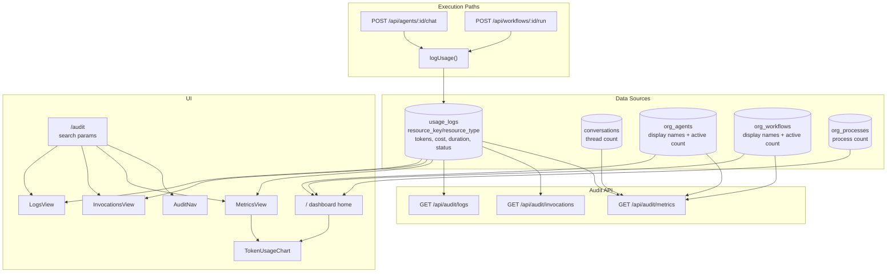

## Giving Jenjco an audit layer
> **Series:** Building Jenjco - Post 4 of N.
>
> **Last verified against:** Next.js 16.1.7, `@mastra/core@1.24.1`, `@mastra/pg@1.9.0`, Supabase JS v2, `ai@6.0.156`, `shadcn@4.2.0`, `recharts@3.8.0`. Mastra and the AI SDK move quickly - cross-check the [Mastra docs](https://mastra.ai/docs) and [AI SDK docs](https://ai-sdk.dev/docs) if you're reading this later.

This is post 4 in the Building Jenjco series. [Post 1](01-agents-core.md) covered the agent runtime, multi-tenant RAG, and request-scoped tool context. [Post 2](02-processes-knowledge-base.md) covered the Processes knowledge base and embedding lifecycle. [Post 3](03-workflows-educational.md) covered Jenjco's first product-facing workflow.

This post covers Phase 6: Audit / Metrics. The goal was to turn the existing `usage_logs` table into a useful admin surface: token totals, approximate cost, recent invocations, raw log rows, success/error status, duration tracking, and a dashboard home that reflects real organisation data.

The interesting problem in this phase was restraint. It is tempting to call this "tracing", but Phase 6 does not build distributed tracing. It builds an audit layer over the product's current usage events, and it keeps the interface honest about what the data can and cannot prove.

---

## What's in scope

- Extending `usage_logs` with `duration_ms` and `status`
- Updating agent and workflow execution paths to log success and failure rows
- Three admin-only audit API routes: metrics, invocations, and logs
- URL-driven audit navigation with `?tab=` and `?view=`
- Server-rendered audit views for metrics, invocations, and raw logs
- A shared `TokenUsageChart` built with shadcn chart primitives and Recharts
- Replacing dashboard placeholders with real counts and 30-day usage data

Out of scope:

- Distributed tracing or span visualisation
- Billing-grade cost attribution
- Workflow token aggregation from nested agent calls
- A date range picker
- Message-level counting
- Exporting or searching raw logs

## Architecture at a glance



There are two paths through the system. Runtime routes write audit events through `logUsage()`. Admin surfaces read those events back either through audit API routes or directly from Server Components.

That split is intentional. The API routes provide a clean client-facing contract for audit data. The Server Components can query Supabase directly where that is simpler and avoids an internal HTTP hop.

---

## Extending usage logs into invocation records

Before Phase 6, `usage_logs` could answer a narrow question: how many tokens did a resource use, and roughly what did that cost?

The audit screen needs two more pieces of information:

- How long did the call take?
- Did it succeed or fail?

The migration adds both:

```sql
-- Phase 6: Add per-invocation metadata to usage_logs
-- duration_ms: wall-clock ms from request start to onFinish/error
-- status: 'success' (default) or 'error' - lets the Invocations view filter failures
ALTER TABLE public.usage_logs
  ADD COLUMN IF NOT EXISTS duration_ms integer,
  ADD COLUMN IF NOT EXISTS status text NOT NULL DEFAULT 'success'
    CHECK (status IN ('success', 'error'));

-- Supports resource breakdown queries in the metrics view
CREATE INDEX IF NOT EXISTS idx_usage_logs_resource_key
  ON public.usage_logs (org_id, resource_key, resource_type);
```

The important choice is that failures are logged as rows, not hidden in application logs. A failed agent call still matters operationally, even if it has no token usage and no cost estimate.

The logger now accepts invocation metadata:

```typescript
const COST_PER_INPUT = 0.00015 / 1000
const COST_PER_OUTPUT = 0.0006 / 1000

export async function logUsage({
  orgId,
  userId,
  resourceKey,
  resourceType = 'agent',
  tokensIn,
  tokensOut,
  durationMs,
  status = 'success',
}: {
  orgId: string
  userId: string
  resourceKey: string
  resourceType?: 'agent' | 'workflow'
  tokensIn: number
  tokensOut: number
  durationMs?: number
  status?: 'success' | 'error'
}) {
  const supabase = await createClient()
  const costEstimate = tokensIn * COST_PER_INPUT + tokensOut * COST_PER_OUTPUT

  await supabase.from('usage_logs').insert({
    org_id: orgId,
    user_id: userId,
    resource_key: resourceKey,
    resource_type: resourceType,
    tokens_in: tokensIn,
    tokens_out: tokensOut,
    cost_estimate: costEstimate,
    duration_ms: durationMs ?? null,
    status,
  })
}
```

The cost constants are deliberately local and commented as approximations. They are useful enough for an MVP audit page, but they are not a billing system. A future version needs per-model pricing, currency handling, and a clearer boundary between product analytics and billing records.

---

## Logging agent success and failure

Agent chat already had a natural place to record token usage: the stream `onFinish` callback. Phase 6 adds a `startTime` before the stream is created and records duration when the model finishes:

```typescript
const startTime = Date.now()

let stream: Awaited<ReturnType<typeof agent.stream>>
try {
  stream = await agent.stream(messages, {
    instructions: orgAgent.system_prompt_override ?? undefined,
    requestContext,
    memory: {
      thread: threadId,
      resource: appUser.id,
    },
    onFinish: async (result) => {
      await logUsage({
        orgId: appUser.orgId,
        userId: appUser.id,
        resourceKey: orgAgent.agent_key,
        tokensIn: result.usage?.inputTokens ?? 0,
        tokensOut: result.usage?.outputTokens ?? 0,
        durationMs: Date.now() - startTime,
        status: 'success',
      })
    },
  })
} catch {
  await logUsage({
    orgId: appUser.orgId,
    userId: appUser.id,
    resourceKey: orgAgent.agent_key,
    tokensIn: 0,
    tokensOut: 0,
    durationMs: Date.now() - startTime,
    status: 'error',
  })

  return NextResponse.json({ error: 'Agent stream failed' }, { status: 500 })
}
```

This only catches failures that happen while creating the stream. If an error happens later inside the stream lifecycle, it depends on how the underlying runtime surfaces that failure. For this phase, the implementation captures the obvious hard failure path without pretending to be a complete telemetry layer.

There is also a product detail hidden in the numbers: error rows record `0` tokens. That keeps cost and token totals clean while still letting the Invocations view show reliability problems.

---

## Logging workflow runs

Workflow runs use the same pattern, but the logging happens inside the `ReadableStream` that was introduced in Phase 5.

```typescript
const startTime = Date.now()

const stream = new ReadableStream({
  async start(controller) {
    try {
      const run = await mastraWorkflow.createRun()
      const streamResult = run.stream({ inputData })

      const reader = streamResult.fullStream.getReader()
      try {
        while (true) {
          const { done, value } = await reader.read()
          if (done) break
          controller.enqueue(send(value))
        }
      } finally {
        reader.releaseLock()
      }

      const result = await streamResult.result
      controller.enqueue(send({ type: "workflow-result", result }))

      await logUsage({
        orgId: appUser.orgId,
        userId: appUser.id,
        resourceKey: wf.workflow_key,
        resourceType: "workflow",
        tokensIn: 0,
        tokensOut: 0,
        durationMs: Date.now() - startTime,
        status: "success",
      })
    } catch (err) {
      await logUsage({
        orgId: appUser.orgId,
        userId: appUser.id,
        resourceKey: wf.workflow_key,
        resourceType: "workflow",
        tokensIn: 0,
        tokensOut: 0,
        durationMs: Date.now() - startTime,
        status: "error",
      })

      controller.enqueue(send({ type: "error", message: String(err) }))
    } finally {
      controller.close()
    }
  },
})
```

Workflow tokens are still `0`. That is not ideal, but it is honest. The demo workflow calls an agent internally, and the product does not yet have a clean aggregation path from nested agent usage back to the workflow route. Phase 6 records that a workflow ran, how long it took, and whether it failed. Cost attribution can come later.

---

## Three audit API routes

Phase 6 adds three admin-only API routes:

- `GET /api/audit/metrics`
- `GET /api/audit/invocations`
- `GET /api/audit/logs`

All three start with the same security posture:

```typescript
const { appUser } = await getServerAuth()
if (!appUser) return NextResponse.json({ error: 'Unauthorized' }, { status: 401 })
if (appUser.role !== 'admin') return NextResponse.json({ error: 'Forbidden' }, { status: 403 })
```

The metrics route returns the aggregated shape: total conversations, token totals, cost total, per-resource breakdown, and daily chart points for the last 30 days.

```typescript
const { data: rows } = await supabase
  .from('usage_logs')
  .select('resource_key, resource_type, tokens_in, tokens_out, cost_estimate, created_at')
  .eq('org_id', appUser.orgId)
  .eq('status', 'success')
  .gte('created_at', since)
  .order('created_at', { ascending: true })

const allRows = rows ?? []

const totalTokensIn = allRows.reduce((s, r) => s + (r.tokens_in ?? 0), 0)
const totalTokensOut = allRows.reduce((s, r) => s + (r.tokens_out ?? 0), 0)
const totalCost = allRows.reduce((s, r) => s + Number(r.cost_estimate ?? 0), 0)
```

Notice the `status = success` filter. Error rows are visible in invocations and logs, but they are excluded from token and cost totals. That keeps the main KPI cards from being polluted by operational failure records.

The invocations route returns recent rows with human-readable resource names. It supports `?type=agent|workflow` and basic offset pagination:

```typescript
const type = searchParams.get('type')
const page = Math.max(0, parseInt(searchParams.get('page') ?? '0', 10))

let query = supabase
  .from('usage_logs')
  .select(
    'id, resource_key, resource_type, tokens_in, tokens_out, cost_estimate, duration_ms, status, created_at, user_id'
  )
  .eq('org_id', appUser.orgId)
  .gte('created_at', since)
  .order('created_at', { ascending: false })
  .range(page * PAGE_SIZE, (page + 1) * PAGE_SIZE - 1)

if (type === 'agent' || type === 'workflow') query = query.eq('resource_type', type)
```

The logs route is intentionally raw. It returns rows from `usage_logs` newest-first with a larger page size. This is the "show me the records" view, not the product-friendly summary.

---

## URL-based audit navigation

The audit page has two axes:

- `tab`: `agents` or `workflows`
- `view`: `metrics`, `invocations`, or `logs`

Those live in the URL instead of client state:

```typescript
export default async function AuditPage({
  searchParams,
}: {
  searchParams: Promise<Record<string, string | undefined>>
}) {
  const { appUser } = await getServerAuth()
  if (!appUser) redirect(paths.signIn)
  if (appUser.role !== "admin") redirect(paths.dashboard)

  const params = await searchParams
  const { tab = "agents", view = "metrics" } = params
  const activeTab: Tab = tab === "workflows" ? "workflows" : "agents"
  const activeView: View = ["metrics", "invocations", "logs"].includes(view ?? "")
    ? (view as View)
    : "metrics"

  return (
    <div className="flex flex-col gap-6 p-6">
      <AuditNav activeTab={activeTab} activeView={activeView} />

      {activeView === "metrics" && (
        <MetricsView tab={activeTab} orgId={appUser.orgId} />
      )}
      {activeView === "invocations" && (
        <InvocationsView tab={activeTab} orgId={appUser.orgId} />
      )}
      {activeView === "logs" && <LogsView orgId={appUser.orgId} />}
    </div>
  )
}
```

This makes audit links shareable and keeps refresh behaviour simple. It also avoids introducing a client-side state machine for a page that is mostly server-rendered data.

`AuditNav` is the only Client Component in the audit feature:

```tsx
function href(tab: string, view: string) {
  return `${paths.audit}?tab=${tab}&view=${view}`
}

export function AuditNav({
  activeTab,
  activeView,
}: {
  activeTab: Tab
  activeView: View
}) {
  return (
    <div className="flex flex-col gap-2 border-b pb-4">
      <div className="flex gap-1">
        {TABS.map((t) => (
          <Link key={t.id} href={href(t.id, activeView)}>
            {t.label}
          </Link>
        ))}
      </div>
      <div className="flex gap-1">
        {VIEWS.map((v) => (
          <Link key={v.id} href={href(activeTab, v.id)}>
            {v.label}
          </Link>
        ))}
      </div>
    </div>
  )
}
```

The active state is passed down from the Server Component, so `AuditNav` does not need `useSearchParams()`.

---

## Metrics, invocations, and logs

The audit UI is split into three Server Components.

`MetricsView` answers "how much is being used?":

```typescript
const resourceType = tab === "agents" ? "agent" : "workflow"

const [{ count: totalConversations }, { data: rows }] = await Promise.all([
  supabase
    .from("conversations")
    .select("*", { count: "exact", head: true })
    .eq("org_id", orgId),
  supabase
    .from("usage_logs")
    .select("resource_key, resource_type, tokens_in, tokens_out, cost_estimate, created_at")
    .eq("org_id", orgId)
    .eq("resource_type", resourceType)
    .eq("status", "success")
    .gte("created_at", since)
    .order("created_at", { ascending: true }),
])

const totalTokens = allRows.reduce(
  (s, r) => s + (r.tokens_in ?? 0) + (r.tokens_out ?? 0),
  0
)
const totalCost = allRows.reduce(
  (s, r) => s + Number(r.cost_estimate ?? 0),
  0
)
```

`InvocationsView` answers "what just ran?":

```tsx
<tbody>
  {rows.map((r) => (
    <tr key={r.id} className="border-b last:border-0 hover:bg-muted/30">
      <td className="px-4 py-2 font-medium">
        {nameMap[r.resource_key ?? ""] ?? r.resource_key}
      </td>
      <td className="px-4 py-2">
        <Badge variant={r.status === "success" ? "default" : "destructive"}>
          {r.status}
        </Badge>
      </td>
      <td className="px-4 py-2 tabular-nums">
        {(r.tokens_in ?? 0).toLocaleString()}
      </td>
      <td className="px-4 py-2 tabular-nums">
        {(r.tokens_out ?? 0).toLocaleString()}
      </td>
      <td className="px-4 py-2 tabular-nums">
        {r.duration_ms != null ? `${r.duration_ms}ms` : "-"}
      </td>
    </tr>
  ))}
</tbody>
```

`LogsView` answers "what exactly is in the table?":

```typescript
const { data, count } = await supabase
  .from("usage_logs")
  .select(
    "id, resource_key, resource_type, tokens_in, tokens_out, cost_estimate, duration_ms, status, created_at",
    { count: "exact" }
  )
  .eq("org_id", orgId)
  .order("created_at", { ascending: false })
  .range(page * PAGE_SIZE, (page + 1) * PAGE_SIZE - 1)
```

The names matter. I avoided calling the middle view "Traces" because these rows are not traces. They are invocation records. That distinction keeps the product vocabulary aligned with the implementation.

---

## The shared token chart

The audit page and dashboard home both need the same visual: token totals per day over the last 30 days. Rather than duplicate chart code, Phase 6 adds `TokenUsageChart`.

```tsx
"use client"

import { Bar, BarChart, XAxis, YAxis } from "recharts"

import {
  ChartContainer,
  ChartTooltip,
  ChartTooltipContent,
} from "@/components/ui/chart"

type DayPoint = { date: string; tokens: number }

const CHART_CONFIG = {
  tokens: { label: "Tokens", color: "hsl(var(--chart-1))" },
}

export function TokenUsageChart({ data }: { data: DayPoint[] }) {
  if (!data.length) {
    return (
      <div className="flex h-44 items-center justify-center text-sm text-muted-foreground">
        No usage data for this period
      </div>
    )
  }

  return (
    <ChartContainer config={CHART_CONFIG} className="h-44 w-full">
      <BarChart data={data} margin={{ top: 4, right: 0, left: -20, bottom: 0 }}>
        <XAxis
          dataKey="date"
          tick={{ fontSize: 10 }}
          tickFormatter={(d) => d.slice(5)}
        />
        <YAxis tick={{ fontSize: 10 }} />
        <ChartTooltip content={<ChartTooltipContent />} />
        <Bar
          dataKey="tokens"
          fill="var(--color-tokens)"
          radius={[2, 2, 0, 0]}
        />
      </BarChart>
    </ChartContainer>
  )
}
```

This is a small component, but it is a useful boundary. The data preparation stays server-side. The chart library stays client-side. The two meet at a simple `{ date, tokens }[]` prop.

---

## Wiring the dashboard to real data

Before Phase 6, the dashboard home was still a placeholder. This phase connects it to the same data model as the audit page:

```typescript
const [
  { count: agentCount },
  { count: workflowCount },
  { count: processCount },
  { data: usageRows },
] = await Promise.all([
  supabase
    .from("org_agents")
    .select("*", { count: "exact", head: true })
    .eq("org_id", appUser.orgId)
    .eq("is_active", true),
  supabase
    .from("org_workflows")
    .select("*", { count: "exact", head: true })
    .eq("org_id", appUser.orgId)
    .eq("is_active", true),
  supabase
    .from("org_processes")
    .select("*", { count: "exact", head: true })
    .eq("org_id", appUser.orgId),
  supabase
    .from("usage_logs")
    .select("created_at, tokens_in, tokens_out")
    .eq("org_id", appUser.orgId)
    .gte("created_at", since)
    .order("created_at", { ascending: true }),
])
```

The dashboard now shows:

- Active agents
- Active workflows
- Process documents
- Daily token usage for the last 30 days

That makes the app home feel connected to the organisation's real state, while the full audit page remains the admin-focused drill-down.

---

## What I'd do differently

**Move aggregation into database functions once row counts grow.** Bucketing daily token usage in JavaScript is fine for MVP data volumes. At scale, this should become a SQL aggregation or a materialized reporting table.

**Add date range controls.** The hardcoded 30-day window keeps the first interface simple, but audit views eventually need `from` and `to` parameters, presets, and probably a consistent timezone policy.

**Track model identity per invocation.** Cost estimates are currently based on hardcoded GPT-4o rates. A real billing or margin view needs model, provider, input price, output price, and the price version used at the time of the call.

**Aggregate nested workflow token usage.** Workflow rows currently prove execution, duration, and status. They do not yet capture the cost of the agent calls inside the workflow.

**Separate audit events from billing events.** `usage_logs` is doing useful MVP work, but observability and billing have different requirements. Billing records need stricter immutability, pricing snapshots, and reconciliation behaviour.

**Add pagination controls to the server views.** The API routes understand pages, and `LogsView` accepts a page prop, but the UI still needs proper next/previous controls wired into the URL.

---

## Series context

This is the fourth post in the series. The first three phases made Jenjco useful: agents could answer questions, process documents could become searchable knowledge, and workflows could orchestrate agent work.

Phase 6 makes the product more accountable. Admins can now see what ran, when it ran, how much it used, roughly what it cost, whether it failed, and how long it took. It is still an MVP audit layer, but it gives the rest of the application a measurable operational foundation.

## Links and references

- [Next.js Route Handlers](https://nextjs.org/docs/app/building-your-application/routing/route-handlers)
- [Next.js Search Params](https://nextjs.org/docs/app/api-reference/file-conventions/page#searchparams-optional)
- [Supabase JavaScript Client](https://supabase.com/docs/reference/javascript/introduction)
- [shadcn Charts](https://ui.shadcn.com/charts)
- [Recharts](https://recharts.org/)
- [Mastra Workflows](https://mastra.ai/docs/workflows)

If you spot something wrong or want to compare notes - [email](mailto:eliott.c.h.byrnes@googlemail.com).

---

*Last verified against: Next.js 16.1.7, `@mastra/core@1.24.1`, `@mastra/pg@1.9.0`, Supabase JS v2, `ai@6.0.156`, `shadcn@4.2.0`, `recharts@3.8.0`. Published 2026-05-02.*
