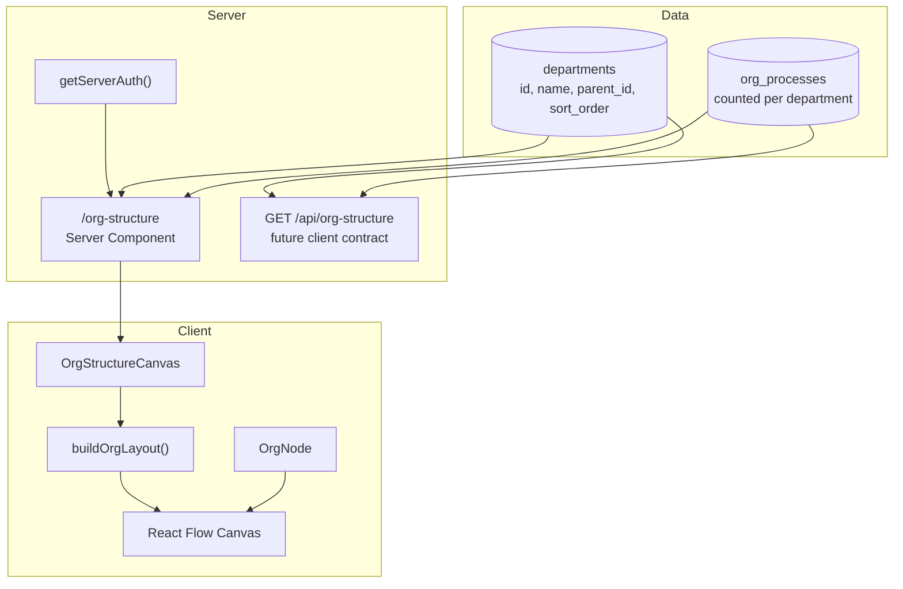

## Mapping Jenjco's organisation structure
> **Series:** Building Jenjco - Post 5 of N.
>
> **Last verified against:** Next.js 16.1.7, React 19.2.4, `@xyflow/react@12.10.2`, `@dagrejs/dagre@3.0.0`, Supabase JS v2, `shadcn@4.2.0`. Next.js, React Flow, and Supabase move quickly - cross-check the [Next.js docs](https://nextjs.org/docs), [React Flow docs](https://reactflow.dev/), and [Supabase docs](https://supabase.com/docs) if you're reading this later.

This is post 5 in the Building Jenjco series. [Post 1](01-agents-core.md) covered the agent runtime, multi-tenant RAG, and request-scoped tool context. [Post 2](02-processes-knowledge-base.md) covered the Processes knowledge base and embedding lifecycle. [Post 3](03-workflows-educational.md) covered Jenjco's first product-facing workflow. [Post 4](04-audit-metrics.md) covered the audit and metrics layer.

This post covers Phase 7: Org Structure. The goal was to turn the existing `departments` table into a readable organisation chart: the organisation at the root, departments arranged below it, parent-child relationships drawn as edges, and process counts shown directly on each department node.

The interesting problem in this phase was keeping the chart visual without making it stateful. Org structure is read-only for the MVP, so the page should feel like a product surface without acting like an editor. React Flow gives the canvas, Dagre gives the layout, and the server still owns the data.

---

## What's in scope

- Installing `@dagrejs/dagre` for automatic hierarchy layout
- Expanding the seed data with `Finance` and `HR` as root departments
- Registering `apiPaths.orgStructure`
- A small layout library that converts department rows into React Flow nodes and edges
- A custom top-to-bottom `OrgNode`
- A read-only React Flow canvas with an empty state
- A protected `GET /api/org-structure` route for future client use
- Replacing the placeholder `/org-structure` page with a Server Component

Out of scope:

- Drag-and-drop editing
- Department creation, deletion, or re-parenting
- Persisting node positions
- Role-based edit controls
- Multiple layout modes
- Deep process drill-down from a node
- Search, filtering, or collapsed subtrees

## Architecture at a glance



There are two read paths over the same data. The page queries Supabase directly because it is already a Server Component. The API route exists as a stable JSON contract for future client-side interactions.

That split keeps the current product simple while avoiding a dead end. The MVP page does not need to fetch its own API route, but a future editor, search panel, or refreshable client view can reuse the same response shape.

---

## Seeding a more useful hierarchy

Before Phase 7, the demo organisation had one meaningful branch: `Operations -> Sales, Customer Service`. That was enough to attach process documents to departments, but it made a weak organisation chart.

The seed now creates three root departments and two children under Operations:

```text
John Pye
|-- Operations
|   |-- Sales
|   `-- Customer Service
|-- Finance
`-- HR
```

The first important seed change is that departments are deleted before being recreated. Because the script is used during bootstrapping, a repeatable seed is more useful than trying to preserve manually adjusted demo rows:

```typescript
async function deleteDepartmentsForOrg(
  supabase: SupabaseClient,
  orgId: string
): Promise<void> {
  const { data: depts, error: selErr } = await supabase
    .from("departments")
    .select("id, parent_id")
    .eq("org_id", orgId)
  if (selErr) throw selErr
  const rows = (depts ?? []) as DeptRow[]
  if (!rows.length) return

  const children = rows.filter((d) => d.parent_id != null)
  for (const c of children) {
    const { error } = await supabase.from("departments").delete().eq("id", c.id)
    if (error) throw error
  }
  const roots = rows.filter((d) => d.parent_id == null)
  for (const r of roots) {
    const { error } = await supabase.from("departments").delete().eq("id", r.id)
    if (error) throw error
  }
}
```

Then the seed inserts root siblings with explicit `sort_order` values:

```typescript
const { data: opsDept, error: opsErr } = await supabase
  .from("departments")
  .insert({
    org_id: orgId,
    name: "Operations",
    parent_id: null,
    sort_order: 0,
  })
  .select("id")
  .single()
if (opsErr) throw opsErr

const { error: financeErr } = await supabase
  .from("departments")
  .insert({
    org_id: orgId,
    name: "Finance",
    parent_id: null,
    sort_order: 1,
  })
  .select("id")
  .single()
if (financeErr) throw financeErr

const { error: hrErr } = await supabase
  .from("departments")
  .insert({
    org_id: orgId,
    name: "HR",
    parent_id: null,
    sort_order: 2,
  })
  .select("id")
  .single()
if (hrErr) throw hrErr
```

There is still no department management UI. That is deliberate. This phase is about making the existing data visible and useful before adding mutation paths.

---

## Turning rows into a graph

React Flow renders positioned nodes and edges. The database stores a flat list of department rows. The small but important bridge between those two worlds is `buildOrgLayout()`.

The layout input is intentionally plain:

```typescript
export type DeptRow = {
  id: string
  name: string
  parent_id: string | null
  sort_order: number
  process_count: number
}

export type OrgNodeData = {
  label: string
  isRoot: boolean
  processCount?: number
}
```

`DeptRow` mirrors the shape returned by Supabase. `OrgNodeData` is the smaller display contract consumed by the custom React Flow node.

The layout function adds a synthetic root node for the organisation name, registers every department with Dagre, and connects each department either to its parent department or to the root:

```typescript
const ROOT_ID = "__org_root__"

export function buildOrgLayout(
  orgName: string,
  departments: DeptRow[]
): { nodes: Node<OrgNodeData>[]; edges: Edge[] } {
  const g = new dagre.graphlib.Graph()
  g.setDefaultEdgeLabel(() => ({}))
  g.setGraph({ rankdir: "TB", ranksep: 80, nodesep: 40 })

  g.setNode(ROOT_ID, { width: NODE_WIDTH, height: NODE_HEIGHT })

  for (const dept of departments) {
    g.setNode(dept.id, { width: NODE_WIDTH, height: NODE_HEIGHT })
  }

  for (const dept of departments) {
    g.setEdge(dept.parent_id ?? ROOT_ID, dept.id)
  }

  dagre.layout(g)

  // ...
}
```

The `rankdir: "TB"` setting is the core layout choice. Jenjco's workflow canvas already uses a left-to-right shape, but an organisation chart reads more naturally from top to bottom.

One small mismatch matters: Dagre returns center-based coordinates, while React Flow expects the top-left corner of each node. The conversion happens in one place:

```typescript
const toRfNode = (id: string, data: OrgNodeData): Node<OrgNodeData> => ({
  id,
  type: "orgNode",
  position: {
    x: g.node(id).x - NODE_WIDTH / 2,
    y: g.node(id).y - NODE_HEIGHT / 2,
  },
  targetPosition: Position.Top,
  sourcePosition: Position.Bottom,
  data,
})
```

This is the kind of logic that belongs in a helper rather than inside a component render body. The component should receive nodes and edges; it should not need to remember coordinate systems.

---

## A node for hierarchy, not workflows

Jenjco already had React Flow node components from the workflow work. Reusing them would have been tempting, but they were designed for a horizontal workflow graph with left and right handles.

The org chart needs the opposite. Incoming edges enter from the top. Child edges leave from the bottom.

```tsx
"use client"

import { Handle, type Node as RFNode, type NodeProps, Position } from "@xyflow/react"
import { Badge } from "@/components/ui/badge"
import { Card, CardContent, CardHeader, CardTitle } from "@/components/ui/card"
import { cn } from "@/lib/utils"
import type { OrgNodeData } from "../lib/layout"

type OrgRfNode = RFNode<OrgNodeData, "orgNode">

export function OrgNode({ data }: NodeProps<OrgRfNode>) {
  return (
    <Card
      className={cn(
        "relative w-[180px] gap-0 rounded-md p-0",
        data.isRoot && "border-primary"
      )}
    >
      {!data.isRoot && <Handle type="target" position={Position.Top} />}

      <CardHeader className="gap-0 rounded-t-md border-b bg-secondary p-3!">
        <CardTitle className="text-sm">{data.label}</CardTitle>
      </CardHeader>

      {!data.isRoot && (
        <CardContent className="p-3">
          <Badge variant="secondary" className="text-xs">
            {data.processCount ?? 0}{" "}
            {data.processCount === 1 ? "process" : "processes"}
          </Badge>
        </CardContent>
      )}

      <Handle type="source" position={Position.Bottom} />
    </Card>
  )
}
```

The root node gets special treatment. It has the organisation name, a primary border, and no process count. That keeps the chart vocabulary clear: the root represents the tenant, while department nodes represent organisational units.

The process count badge is intentionally modest. It gives the chart a connection back to the Processes phase without turning this page into a process browser.

---

## Keeping the canvas read-only

`OrgStructureCanvas` is the client boundary. It receives `orgName` and `departments` as props, builds the layout with `useMemo()`, and renders React Flow through the existing AI Elements canvas primitives.

```tsx
"use client"

import { useMemo } from "react"
import { ReactFlowProvider } from "@xyflow/react"
import { Canvas } from "@/components/ai-elements/canvas"
import { Controls } from "@/components/ai-elements/controls"
import { Panel } from "@/components/ai-elements/panel"
import { buildOrgLayout, type DeptRow } from "../lib/layout"
import { OrgNode } from "./org-node"

const nodeTypes = { orgNode: OrgNode }

export function OrgStructureCanvas({
  orgName,
  departments,
}: OrgStructureCanvasProps) {
  const { nodes, edges } = useMemo(
    () => buildOrgLayout(orgName, departments),
    [orgName, departments]
  )

  if (departments.length === 0) {
    return (
      <div className="flex h-full items-center justify-center text-sm text-muted-foreground">
        No departments have been configured for this organisation.
      </div>
    )
  }

  return (
    <ReactFlowProvider>
      <div className="relative flex h-full min-h-0 w-full flex-1 flex-col">
        <Canvas
          nodes={nodes}
          edges={edges}
          nodeTypes={nodeTypes}
          nodesDraggable={false}
          nodesConnectable={false}
          elementsSelectable={false}
          deleteKeyCode={null}
          selectionOnDrag={false}
          fitView
          className="h-full w-full"
        >
          <Controls className="shadow-none!" />
          <Panel className="m-4 flex max-w-xs flex-col gap-1 rounded-md border bg-card/95 p-3 shadow-sm backdrop-blur-sm">
            <p className="text-sm font-semibold">{orgName}</p>
            <p className="text-xs text-muted-foreground">
              Organisation structure
            </p>
          </Panel>
        </Canvas>
      </div>
    </ReactFlowProvider>
  )
}
```

The read-only settings are doing product work:

- `nodesDraggable={false}` means users cannot imply a position change that will not be saved.
- `nodesConnectable={false}` means users cannot draw relationships that do not exist.
- `elementsSelectable={false}` and `selectionOnDrag={false}` keep the page from feeling like an editor.
- `deleteKeyCode={null}` removes a keyboard affordance that would be misleading here.

The canvas still has zoom controls and `fitView`, so the result feels inspectable without becoming mutable.

---

## Fetching the chart on the server

The `/org-structure` page is a Server Component. It authenticates the user, reads departments and process counts from Supabase, maps the rows into the shared `DeptRow` shape, and passes them into the client canvas.

```tsx
export const metadata: Metadata = { title: "Org Structure" }

export default async function OrgStructurePage() {
  const { appUser, organization } = await getServerAuth()
  if (!appUser) redirect(paths.signIn)

  const supabase = await createClient()
  const { data } = await supabase
    .from("departments")
    .select("id, name, parent_id, sort_order, org_processes(id)")
    .eq("org_id", appUser.orgId)
    .order("sort_order")

  const departments: DeptRow[] = (data ?? []).map((r) => ({
    id: r.id,
    name: r.name,
    parent_id: r.parent_id,
    sort_order: r.sort_order,
    process_count: Array.isArray(r.org_processes) ? r.org_processes.length : 0,
  }))

  return (
    <div className="h-[calc(100vh-4rem)] w-full">
      <OrgStructureCanvas
        orgName={organization?.name ?? "Organisation"}
        departments={departments}
      />
    </div>
  )
}
```

The height wrapper is not decoration. React Flow needs a bounded parent height; without it the canvas has no reliable space to measure and fit into.

Unlike the audit page, org structure is not admin-only. Viewers can read it too. That matches the product model for this phase: organisation structure is shared context, not an administrative control surface.

---

## A route for future client use

The page does not call `GET /api/org-structure`, but the route still matters. It gives the feature a JSON boundary that can support future client-side refresh, search, editing, or tests.

```typescript
export async function GET() {
  const { appUser } = await getServerAuth()
  if (!appUser) {
    return NextResponse.json({ error: "Unauthorized" }, { status: 401 })
  }

  const supabase = await createClient()
  const { data, error } = await supabase
    .from("departments")
    .select("id, name, parent_id, sort_order, org_processes(id)")
    .eq("org_id", appUser.orgId)
    .order("sort_order")

  if (error) {
    return NextResponse.json({ error: error.message }, { status: 500 })
  }

  const departments = (data ?? []).map((r) => ({
    id: r.id,
    name: r.name,
    parent_id: r.parent_id,
    sort_order: r.sort_order,
    process_count: Array.isArray(r.org_processes) ? r.org_processes.length : 0,
  }))

  return NextResponse.json({ departments })
}
```

The route uses the same tenant boundary as the page: `getServerAuth()` determines the current user's organisation, and the query filters by `appUser.orgId`. The client never supplies an organisation ID.

The app path registry now exposes the route alongside the other API paths:

```typescript
export const apiPaths = {
  chat: '/api/chat',
  agents: '/api/agents',
  agentChat: (id: string) => `/api/agents/${id}/chat`,
  processes: '/api/processes',
  processDetail: (id: string) => `/api/processes/${id}`,
  workflows: '/api/workflows',
  workflowDetail: (id: string) => `/api/workflows/${id}`,
  workflowRun: (id: string) => `/api/workflows/${id}/run`,
  auditMetrics: '/api/audit/metrics',
  auditInvocations: '/api/audit/invocations',
  auditLogs: '/api/audit/logs',
  orgStructure: '/api/org-structure',
} as const
```

That keeps route construction centralised and avoids another hardcoded string when the endpoint starts being consumed.

---

## Why Dagre here

For a small tree, it would be possible to hand-place nodes with a few loops. That would work until the first uneven branch, missing parent, or new layout requirement.

Dagre is a better fit for this phase because the product needs a graph layout, not custom geometry. The implementation only tells Dagre three things:

- The direction is top-to-bottom.
- Every node has a fixed width and height.
- Edges represent parent-child relationships.

Everything else is derived.

This is also why the layout helper returns normal React Flow primitives instead of a custom intermediate model. The codebase already uses React Flow. Phase 7 adds a layout step, not a second graph abstraction.

---

## What I'd do differently

**Handle missing parents explicitly.** The current layout assumes every `parent_id` points to another department in the same result set. That is reasonable for seeded MVP data, but a production route should decide how to display or reject orphaned departments.

**Move process counts into a clearer query shape.** Counting `org_processes(id)` arrays works for now. If this grows, a view or RPC that returns `department_id, process_count` would make the query intent clearer and avoid pulling related IDs into application code.

**Add edit mode as a separate surface.** Read-only mode is right for Phase 7. When editing arrives, it should be explicit: separate permissions, save/cancel affordances, validation, and probably optimistic updates. It should not be hidden behind the same passive chart.

**Consider collapsed branches.** A larger organisation will need expand/collapse controls or filtering. The current `fitView` canvas is comfortable for the seed tree, but it will not stay readable for dozens of departments.

**Test the layout helper directly.** `buildOrgLayout()` is deterministic and easy to unit test. A few tests for root edges, child edges, and coordinate conversion would catch regressions without needing browser automation.

**Make department ordering recursive.** The query orders by `sort_order`, but more complex trees may need deterministic ordering per parent and a secondary sort by name. That should live near the data mapping rather than inside the node component.

---

## Series context

The first six phases made Jenjco useful and measurable: agents could answer questions, process documents became searchable knowledge, workflows orchestrated agent work, and the audit layer made usage visible.

Phase 7 adds organisational context. The product now has a place where departments, process ownership, and tenant structure can be seen together. It is still read-only, but it gives the application a clearer mental model of the organisation it is serving.

## Links and references

- [Next.js Server Components](https://nextjs.org/docs/app/getting-started/server-and-client-components)
- [Next.js Route Handlers](https://nextjs.org/docs/app/building-your-application/routing/route-handlers)
- [React Flow Custom Nodes](https://reactflow.dev/learn/customization/custom-nodes)
- [React Flow Handles](https://reactflow.dev/learn/customization/handles)
- [Dagre on npm](https://www.npmjs.com/package/@dagrejs/dagre)
- [Supabase JavaScript Client](https://supabase.com/docs/reference/javascript/introduction)

If you spot something wrong or want to compare notes - [email](mailto:eliott.c.h.byrnes@googlemail.com).

---

*Last verified against: Next.js 16.1.7, React 19.2.4, `@xyflow/react@12.10.2`, `@dagrejs/dagre@3.0.0`, Supabase JS v2, `shadcn@4.2.0`. Published 2026-05-02.*
