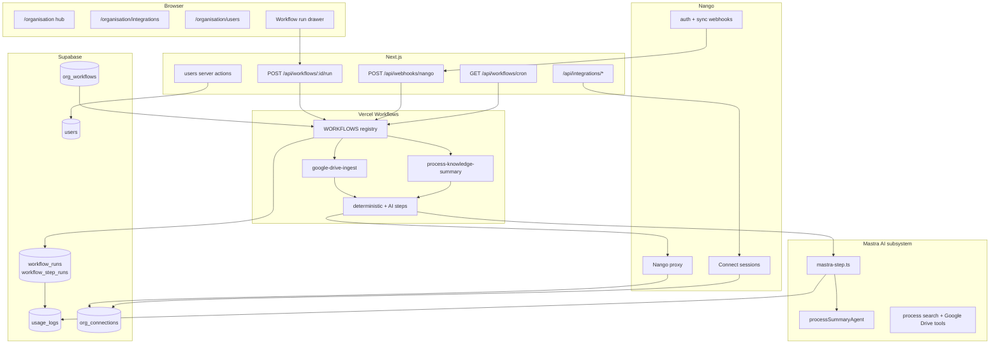

## Taking Jenjco from demo to MVP

> **Series:** Building Jenjco - Post 6 of N.
>
> **Last verified against:** Next.js 16.2.7, React 19.2.4, `@mastra/core@1.41.0`, `@mastra/pg@1.9.0`, `workflow@4.3.1`, `@workflow/next@4.0.9`, `@workflow/ai@5.0.0`, `@nangohq/node@0.70.6`, `@nangohq/frontend@0.70.6`, Supabase JS v2.103, Vitest 4.1.8. Mastra, Vercel Workflows, and Nango all move quickly - cross-check their docs if you're reading this later.

This is post 6 in the Building Jenjco series. [Post 1](../bootstrap/01-agents-core.md) covered the first agent and the multi-tenant RAG path. [Post 2](../bootstrap/02-processes-knowledge-base.md) covered the process knowledge base. [Post 3](../bootstrap/03-workflows-educational.md) covered the first educational workflow surface. [Post 4](../bootstrap/04-audit-metrics.md) added audit and metrics. [Post 5](../bootstrap/05-org-structure.md) added the organisation chart.

This post covers the move from demo to MVP. The goal was not to add one more isolated feature. It was to turn the earlier proof points into a launch-shaped application: a clearer route map, durable workflows, connected accounts, unattended triggers, and a user-management surface that an admin can actually operate.

The interesting problem in this phase was boundaries. By this point Jenjco had agents, workflows, audit logs, organisation data, and Supabase tenancy. The MVP work was about deciding which part of the system is allowed to own each responsibility.

---

## What's in scope

- Moving the product IA under `/organisation` while keeping old URLs redirectable
- Switching workflow orchestration from Mastra workflows to Vercel Workflows
- Demoting Mastra to the AI subsystem: agents, tools, and exactly one workflow AI adapter
- Adding a Supabase workflow ledger with run and step records
- Recording workflow token usage at step level and rolling it up to audit logs
- Adding Nango-backed connected accounts for Google Drive
- Adding cron and Nango webhook triggers for unattended workflow runs
- Adding `/organisation/users` for invite, role, deactivate, reactivate, and remove flows
- Adding focused Vitest coverage around pure workflow and user-management logic

Out of scope:

- A visual workflow builder
- General-purpose trigger configuration UI
- Multi-provider integrations beyond Google Drive
- Billing-grade cost accounting
- A full admin audit trail for every user-management action
- Replacing the seeded demo organisation with a production onboarding flow

## Architecture at a glance




The MVP architecture has four hard lines:

- **Vercel Workflows conducts.** Anything that needs durability, resume, or unattended execution lives in `src/workflows`.
- **Mastra thinks.** Agents and tools stay in `src/mastra`, but Mastra is no longer the workflow conductor.
- **Nango owns external credentials.** Jenjco stores connection status and governance metadata, not provider tokens.
- **Supabase owns tenancy and run truth.** The database is the source of user, organisation, connection, and workflow-run state.

---

## Cleaning up the product map

Before this phase, Jenjco still carried some demo-era routes. Agents, processes, workflows, audit, and org structure all worked, but the information architecture did not yet describe the product.

The route restructure:

- Processes moved under `/organisation/processes`.
- Org structure moved under `/organisation/org-structure`.
- The new organisation hub links to org structure, processes, users, and integrations.
- `/agents` stayed routable but disappeared from the sidebar.
- Old process and org-structure URLs redirect instead of breaking.
- `/api/`* paths stayed stable.

This was a UI and IA cleanup, not an API migration. Keeping the route handlers put reduced the blast radius for workflow, audit, and future integration code.

The decision to hide `/agents` rather than delete it also says something about the MVP shape. Agents are still a core capability, but the product story is shifting from "chat with an agent" to "configure an organisation and run work inside it." Agents become a subsystem exposed through workflows and tools, not always a top-level navigation item.

---

## The conductor swap

Post 3 shipped the first workflow using Mastra's workflow runtime. That was enough to prove the UI: a list-detail workflow page, a read-only canvas, and a drawer that updates step statuses while the run executes.

For the MVP, the runtime needed a stronger contract:

- Runs should survive beyond a single request lifecycle.
- Cron and webhooks should be able to start workflows without a signed-in browser user.
- Workflow status should be persisted in a first-class ledger.
- AI token usage should be attributed to the workflow step that caused it.
- The workflow sandbox should not reach directly into Node, Supabase, Mastra, or Nango from the wrong layer.

That pushed the conductor role to Vercel Workflows.

The production registry is intentionally small:

```typescript
export const WORKFLOWS = {
  "process-knowledge-summary": processKnowledgeSummaryWorkflow,
  "google-drive-ingest": googleDriveIngestWorkflow,
} as const
```

The `_spike` workflow still exists for development, but it is not registered as a production workflow. That avoids accidentally exposing a test harness through cron or webhook paths.

The most important design rule is that `"use workflow"` code stays orchestration-only. Side effects live behind `"use step"` functions. Mastra is reached through one AI adapter. Supabase writes go through runtime helpers. Nango access goes through the integration seam.

That split is less convenient than letting every step import whatever it wants, but it makes the system easier to reason about when a workflow is resumed later or started by a webhook.

---

## The ledger is the run truth

The previous workflow implementation could show the current run in the drawer, but it did not leave enough durable state behind. The MVP adds `workflow_runs` and `workflow_step_runs`.

The key implementation detail is that the app pre-generates the ledger run ID before starting the workflow:

```typescript
const ledgerRunId = crypto.randomUUID()
const workflowInput = buildWorkflowInput(workflowKey, {
  orgId,
  ledgerRunId,
  startedByUserId: startedByUserId ?? null,
  trigger,
})

const run =
  workflowKey === "google-drive-ingest"
    ? await start(WORKFLOWS["google-drive-ingest"], [workflowInput])
    : await start(WORKFLOWS["process-knowledge-summary"], [workflowInput])

await ledger.createRun({
  id: ledgerRunId,
  orgId,
  workflowKey,
  vercelRunId: run.runId,
  startedBy: startedByUserId ?? null,
  trigger,
  input: workflowInput as Json,
})
```

That means every step receives `ledgerRunId` from the first moment of execution. The Vercel run ID is stored, but it is not treated as the database foreign key. The database owns the product run ID; the workflow provider owns the execution ID.

The ledger module is the only writer of run status:

```typescript
export async function markStep({
  ledgerRunId,
  stepId,
  kind,
  status,
  tokensIn = 0,
  tokensOut = 0,
}: {
  ledgerRunId: string
  stepId: string
  kind: StepKind
  status: StepStatus
  tokensIn?: number
  tokensOut?: number
}) {
  const supabase = createAdminClient()
  const { error } = await supabase.from("workflow_step_runs").upsert(
    {
      run_id: ledgerRunId,
      step_id: stepId,
      kind,
      status,
      tokens_in: tokensIn,
      tokens_out: tokensOut,
    },
    { onConflict: "run_id,step_id" }
  )

  if (error) throw error
}
```

This gives the audit layer something firmer than "the route streamed some events." It can now ask what ran, what step failed, and how many tokens were attributed to the AI part of a workflow.

---

## Keeping the drawer experience

Changing the workflow engine did not mean changing the product UI. The run drawer still expects app-level events such as step started, step completed, step failed, and workflow result.

The route now starts a Vercel Workflow run and reads from its status stream:

```typescript
const statusReader = run
  .getReadable({ namespace: STATUS_STREAM_NAMESPACE })
  .getReader()

while (true) {
  const { done, value } = await statusReader.read()
  if (done) break
  const chunk = mapWorkflowStreamChunk(value)
  if (chunk) {
    controller.enqueue(encodeWorkflowStreamChunk(chunk))
  }
}
```

The mapper is the compatibility boundary. The drawer does not need to know whether a status update came from Mastra, Vercel Workflows, or a future conductor. It receives the same app-level stream contract and updates the canvas as before.

Manual runs still finish in the request handler so the drawer can display the result. Unattended runs use the same start path but finalize after the response lifecycle:

```typescript
export function scheduleFinalize(params: FinalizeWorkflowRunParams): void {
  after(() => finalizeWorkflowRun(params))
}
```

That is the first time the workflow path has two real modes:

- **Manual:** browser starts run, route streams status, route finalizes before closing the stream.
- **Unattended:** cron or webhook starts run, response returns quickly, `after()` records completion later.

---

## Mastra becomes the AI seam

The most important file in the conductor swap is not the workflow definition. It is the adapter between Vercel Workflows and Mastra.

```typescript
export async function runMastraProcessSummary({
  orgId,
  userId,
  ledgerRunId,
  stepId,
  resourceKey,
  processes,
}: MastraProcessSummaryParams): Promise<{ text: string }> {
  "use step"

  const agent = getMastra().getAgent("processSummaryAgent")
  const requestContext = new RequestContext<{ orgId: string }>()
  requestContext.set("orgId", orgId)

  const res = await agent.generate(
    [
      {
        role: "user",
        content: `Summarise these business processes into a clear knowledge overview:\n\n${processes}`,
      },
    ],
    { requestContext }
  )

  await recordStepUsage({
    orgId,
    userId,
    ledgerRunId,
    stepId,
    resourceKey,
    tokensIn: res.usage?.inputTokens ?? 0,
    tokensOut: res.usage?.outputTokens ?? 0,
    status: "success",
  })

  return { text: res.text }
}
```

The adapter does three jobs:

1. It is the single place where workflow code calls Mastra.
2. It injects `orgId` through `RequestContext`, preserving the tenant isolation pattern from post 1.
3. It records token usage against the workflow step, not just the top-level workflow.

This is also why workflow agents are memory-less. Chat agents need memory. Workflow steps need repeatable, bounded execution. Letting a high-fan-out workflow step create or touch long-lived Mastra memory would put pressure back on the Postgres store and make the run harder to reason about.

---

## Connected accounts without storing tokens

The MVP adds a connected-account layer for Google Drive. The product needs to know whether an organisation has connected Drive, whether the connection needs attention, and which provider it belongs to. It does not need to store OAuth tokens.

That division lands in `org_connections` and a small provider registry:

```typescript
export const PROVIDERS: Record<ProviderId, ProviderConfig> = {
  "google-drive": {
    id: "google-drive",
    label: "Google Drive",
    nangoIntegrationId: "google-drive",
    scopes: [
      "https://www.googleapis.com/auth/drive.readonly",
      "https://www.googleapis.com/auth/drive.metadata.readonly",
    ],
    ownerTypeDefault: "org",
  },
}
```

Workflow steps and tools resolve a connection by organisation and provider:

```typescript
export async function getConnection(
  orgId: string,
  provider: ProviderId
): Promise<ResolvedConnection> {
  const supabase = createAdminClient()

  const { data, error } = await supabase
    .from("org_connections")
    .select("id, nango_connection_id, status")
    .eq("org_id", orgId)
    .eq("provider", provider)
    .eq("owner_type", "org")
    .maybeSingle()

  if (error) throw error

  if (!data || data.status !== "active") {
    throw new ConnectionError(
      provider,
      (data?.status as "reconnect_required" | "revoked" | undefined) ?? "missing"
    )
  }

  return {
    orgConnectionId: data.id,
    connectionId: data.nango_connection_id,
    provider,
  }
}
```

That gives the workflow runtime a session-independent way to access Google Drive. A cron-triggered run has no browser cookie and no current user session, but it still has an `orgId`. That is enough to resolve the org-owned connection and use Nango's proxy.

The UI side stays admin-gated. Admins can save provider credentials, connect, disconnect, and see connection status. The rest of the product consumes the connection through the seam.

---

## Cron and webhook triggers

Once workflows can run without a browser, they need safe entry points.

The cron route uses a bearer secret and scans active workflow rows with a non-null `schedule_cron`:

```typescript
const authHeader = request.headers.get("authorization")
if (
  !process.env.CRON_SECRET ||
  authHeader !== `Bearer ${process.env.CRON_SECRET}`
) {
  return Response.json({ error: "Unauthorized" }, { status: 401 })
}

const { data: rows } = await supabase
  .from("org_workflows")
  .select("id, org_id, workflow_key")
  .eq("is_active", true)
  .not("schedule_cron", "is", null)
```

There is no seeded schedule. That was intentional. The infrastructure is in place, but enabling a recurring workflow is a post-deploy operational decision rather than something hidden in seed data.

The Nango webhook route verifies the raw body HMAC before parsing JSON:

```typescript
const rawBody = await request.text()
const signature = request.headers.get("x-nango-hmac-sha256")

if (!verifyNangoWebhookSignature(rawBody, signature, secret)) {
  return Response.json({ error: "Invalid signature" }, { status: 401 })
}
```

Then it claims an idempotency key before doing side effects:

```typescript
const key = buildWebhookIdempotencyKey(payload)
if (!(await claimWebhookDelivery(key))) {
  return Response.json({ ok: true, duplicate: true })
}
```

This gives the system two protections:

- Duplicate webhook deliveries do not create duplicate runs.
- A second cron or event does not start the same workflow while one is already running.

The webhook handler does different work for different event families. Auth lifecycle events update `org_connections`. Successful sync events can start `google-drive-ingest` with `trigger = "event"` and `started_by = null`.

That distinction matters in the audit layer. A manual run and an event-triggered run are both workflow runs, but they mean different things operationally.

---

## User management is more than a table edit

The last MVP stage adds `/organisation/users`. It looks like a normal admin CRUD surface, but the write path has several product constraints:

- Only active admins can mutate users.
- Admins cannot remove or deactivate themselves.
- The shared demo admin account is protected.
- The last admin cannot be demoted, deactivated, or removed.
- Invites and auth-user creation use the Supabase service role.
- Normal role and status updates still respect the existing app user model.

The page itself is a simple admin-gated Server Component:

```typescript
const { appUser } = await getServerAuth()
if (!appUser) redirect(paths.signIn)
if (appUser.role !== "admin") redirect(paths.dashboard)

const { data: rows } = await supabase
  .from("users")
  .select("id, email, role, display_name, is_active, invited_at, created_at")
  .eq("org_id", appUser.orgId)
  .order("created_at")
```

The interesting logic sits in pure guard functions. For example:

```typescript
export function assertCanRemove(
  actor: GuardUser,
  target: GuardUser,
  ctx: GuardContext
): GuardResult {
  const adminError = assertActiveAdmin(actor)
  if (adminError) return adminError

  if (actor.id === target.id) {
    return fail("SELF_REMOVE", "You cannot remove your own account")
  }

  if (isDemoAdmin(target.email, ctx.demoAdminEmail)) {
    return fail("DEMO_ADMIN_PROTECTED", "The demo admin account cannot be removed")
  }

  if (isLastAdmin(target, ctx.adminCount)) {
    return fail("LAST_ADMIN", "Cannot remove the last admin")
  }

  return { ok: true }
}
```

These guards are deliberately independent of Supabase. That makes them easy to test and keeps the server actions focused on fetching context, calling the guard, and applying the mutation.

The invite path is the one place where a simple database write is not enough. A user has to exist in Supabase Auth and in `public.users`. If the second write fails after the Auth Admin API succeeds, the action needs to clean up the orphaned auth user. It is the same two-write problem as the embedding lifecycle from post 2, just with identity instead of vectors.

---

## Tests as pressure points

This phase does not try to build a broad test suite all at once. The useful tests are around places where a browser test would be slow and a regression would be expensive:

- Workflow stream mapping
- Ledger transitions
- Idempotency key behavior
- Nango webhook classification
- User guard logic

That is why Vitest enters the project here. The tests are small and mostly pure. They protect the contracts that are easiest to accidentally break while refactoring.

The verification loop for each stacked PR was:

```bash
pnpm run typecheck
pnpm run build
pnpm test
```

Manual verification still mattered for the integration edges: connecting Google Drive, revoking access, running a workflow from the drawer, triggering cron with the bearer secret, and confirming webhook duplicate handling.

---

## What changed conceptually

Before this work, a workflow was something an admin could run from a screen. After this work, a workflow is a durable product event:

- It has a run ID in Jenjco's database.
- It has a trigger type.
- It may or may not have a human actor.
- Its steps can record status and token usage.
- It can be started by UI, cron, or webhook.
- It can depend on org-owned external credentials.

Workflows are no longer just a visual feature. They are the backbone for background automation.

The same is true of users and integrations. A demo can assume one admin and one preconfigured data source. An MVP needs a way to invite teammates, protect admin access, connect external systems, and recover when credentials need attention.

---

## Upcoming Improvement Ideas

**Use a dedicated `workflow_triggers` table.** `schedule_cron` on `org_workflows` is enough for one schedule per workflow, but it will not scale to multiple trigger types, per-trigger enablement, or admin-facing trigger history. A trigger table should become the source of truth.

**Expose workflow run history in the UI.** The ledger exists, but the product does not yet have a rich run-history screen. Admins should be able to inspect past runs, step failures, trigger source, duration, output, and token totals.

**Make integration setup more explicit.** The Google Drive connection path works, but provider setup still spans application UI, Nango dashboard configuration, and environment variables. A production onboarding flow should show which setup steps are complete.

**Treat user invites as a first-class lifecycle.** Invite, pending, accepted, expired, resent, and revoked are different states. The MVP can operate with the current fields, but a richer invitation model would make support and audit cleaner.

**Move more trigger behavior into tested pure functions.** The webhook classifier and idempotency logic are covered, but cron row selection and trigger eligibility rules will get more complicated once admin-configured triggers exist.

**Add a stronger audit trail for admin actions.** `usage_logs` covers runtime activity. User and integration changes deserve their own audit events with actor, target, old value, new value, and timestamp.

---

## Series context

This is the phase where Jenjco stops being a collection of demo surfaces and starts behaving like an MVP application. The core primitives from the earlier posts are still there: agents, process knowledge, workflows, audit, and organisation structure. The difference is that they now sit inside a more explicit operating model.

Vercel Workflows conducts. Mastra supplies AI. Nango supplies connected accounts. Supabase records tenancy, users, credentials metadata, and run truth. The app can now support manual work, scheduled work, and event-driven work without changing the user-facing workflow canvas.

## Links and references

- [Vercel Workflows](https://vercel.com/docs/workflows)
- [Mastra docs](https://mastra.ai/docs)
- [Nango docs](https://docs.nango.dev/)
- [Supabase Auth Admin API](https://supabase.com/docs/reference/javascript/auth-admin-createuser)
- [Next.js `after](https://nextjs.org/docs/app/api-reference/functions/after)`
- [Vitest](https://vitest.dev/)

If you spot something wrong or want to compare notes - [email](mailto:eliott.c.h.byrnes@googlemail.com).

---

*Last verified against: Next.js 16.2.7, React 19.2.4, `@mastra/core@1.41.0`, `workflow@4.3.1`, `@workflow/next@4.0.9`, `@workflow/ai@5.0.0`, `@nangohq/node@0.70.6`, `@nangohq/frontend@0.70.6`, Supabase JS v2.103, Vitest 4.1.8. Published 2026-06-09.*