## Branding the MVP UI

> **Series:** Building Jenjco - Post 7 of N.
>
> **Last verified against:** Next.js 16.2.7, React 19.2.4, `@mastra/core@1.41.0`, `@mastra/pg@1.9.0`, `workflow@4.3.1`, `@workflow/next@4.0.9`, `@workflow/ai@5.0.0`, `@nangohq/node@0.70.6`, `@nangohq/frontend@0.70.6`, Supabase JS v2.103, React Email 1.0.12, Resend 6.12.4, Vitest 4.1.8. These libraries move quickly - cross-check their docs if you're reading this later.

This is post 7 in the Building Jenjco series. [Post 6](./01-demo-to-mvp.md) covered the move from demo to MVP: Vercel Workflows as conductor, Mastra as the AI subsystem, Nango for connected accounts, Supabase as the run ledger, and admin user management.

This post covers the phase after that. The product already had the right primitives, but it still felt like several separate proof points stitched together: a dashboard here, an organisation chart there, workflows somewhere else, audit logs in their own corner.

The work in this phase was about making those surfaces feel like one application. That meant a shared brand system, more intentional hubs, richer analytics, workflow notifications, responsive layouts, and loading states that match the shape of the final UI.

---

## What's in scope

- Adding brand color tokens and a `brand-emerald` button variant
- Replacing dashboard stub workflows with real workflow hub data
- Giving departments stable colors from the database
- Reworking workflows into a hub, detail sheet, canvas, run panel, and audit-log panel
- Reworking processes into a searchable document surface with generated workflow links and a table of contents
- Turning audit into an `/analytics` section with Overview, System Logs, Integrations, and Delivery Logs
- Adding team-aware usage log attribution and exportable system logs
- Adding workflow notification settings, Resend-backed email delivery, digest queuing, and delivery logs
- Making the dashboard app usable at mobile widths
- Moving data-heavy routes to Suspense sections with faithful skeletons
- Adding a dashboard-level error boundary

Out of scope:

- A full visual design system package
- User-configurable theme editing
- Admin UI for every workflow trigger shape
- A full notification preference center per user
- Replacing the seeded demo org with production onboarding
- Route-segment `loading.tsx` as the app-wide loading strategy

---

## Architecture at a glance

```mermaid
flowchart TB
    subgraph brand [Brand Layer]
        Tokens["CSS brand colors"]
        BrandUtils["lib/brand-colors.ts"]
        DeptColor["departments.color"]
        Button["brand-emerald button"]
        DeptColor --> BrandUtils
        Tokens --> BrandUtils
        Tokens --> Button
    end

    subgraph product [Product Hubs]
        Dashboard["/dashboard"]
        Workflows["/workflows"]
        WorkflowDetail["/workflows/:id"]
        Processes["/organisation/processes"]
        OrgStructure["/organisation/org-structure"]
        Integrations["/organisation/integrations"]
    end

    subgraph analytics [Analytics]
        Overview["/analytics/overview"]
        SystemLogs["/analytics/system-logs"]
        IntegrationLogs["/analytics/integrations"]
        DeliveryLogs["/analytics/delivery-logs"]
    end

    subgraph runtime [Runtime Data]
        WorkflowRuns[("workflow_runs")]
        StepRuns[("workflow_step_runs")]
        UsageLogs[("usage_logs")]
        Deliveries[("workflow_notification_deliveries")]
        Notifications[("workflow_notification_settings")]
    end

    subgraph ux [UX Infrastructure]
        Suspense["Route Suspense sections"]
        Skeletons["Co-located skeletons"]
        Responsive["Responsive shell"]
        ErrorBoundary["Dashboard error boundary"]
    end

    BrandUtils --> Dashboard
    BrandUtils --> Workflows
    BrandUtils --> Processes
    BrandUtils --> OrgStructure
    BrandUtils --> Overview
    BrandUtils --> SystemLogs
    BrandUtils --> DeliveryLogs
    WorkflowRuns --> Workflows
    WorkflowRuns --> Overview
    StepRuns --> WorkflowDetail
    StepRuns --> Overview
    UsageLogs --> SystemLogs
    Notifications --> Workflows
    Deliveries --> DeliveryLogs
    Suspense --> product
    Skeletons --> product
    Responsive --> product
```




The main architectural change is that presentation now has shared sources of truth:

- **Brand tokens** live in CSS and `lib/brand-colors.ts`.
- **Department color** lives on `departments.color`, not array order.
- **Workflow and log statuses** map through shared badge classes.
- **Loading states** live beside the components they mirror.
- **Analytics pages** read from the workflow and usage ledger instead of old audit-specific routes.

That gives the UI enough structure to keep expanding without every page inventing its own language.

---

## Brand colors became data

The first pass added five brand colors as Tailwind theme tokens: orange, violet, amber, sky, and emerald. It also introduced a shared `brand-emerald` button variant for the product's main positive action: run, request, save, connect.

Earlier, the dashboard could assign colors by department index. That is fine for a demo, but it breaks down as soon as two pages fetch departments in different orders or one page filters the list. The same team should not be orange on the dashboard and sky in analytics.

The fix was a small schema change:

```sql
ALTER TABLE public.departments
  ADD COLUMN IF NOT EXISTS color text
  CHECK (color IN ('orange', 'violet', 'amber', 'sky', 'emerald'));
```

Then `buildDepartmentColorMap` changed from "choose by position" to "prefer the database value, fall back to position only when needed."

That is the difference between a style helper and a product invariant. A department's color is now stable across the dashboard, workflow hub, analytics tables, process detail, org structure, and users.

The same pattern spread to status styling. Workflow state, run state, step kind, usage log status, notification delivery status, and role badges now use shared semantic classes where possible. Red still means destructive failure. Amber means running or attention. Emerald means success or configured. Orange is warning or admin. Sky and violet carry neutral categorization.

---

## The dashboard

The dashboard now reads real workflow hub data through `get_workflows_hub`, including department, last execution, run count, and provider list. The workflow cards render provider icons instead of grey squares, and the same department color map used elsewhere drives the card badges and filters.

This did two things:

1. The dashboard became a real overview rather than a product mock.
2. The workflow hub data contract became reusable across multiple surfaces.

The provider icon map was deliberately centralized too. A workflow should not need to know whether `"google"` maps to a Simple Icons Google mark or whether `"browser"` falls back to a Lucide globe. It just passes a provider string and gets a consistent icon.

---

## Workflows

Post 6 focused on workflow runtime boundaries. This phase focused on the workflow product surface.

The workflows list became a real hub:

- Search by workflow name
- Filter by team
- Sort by name, last execution, or run count
- Show `active`, `inactive`, and `flagged` states
- Open a detail sheet from a row
- Link related processes from the sheet
- Request or flag a workflow through dialog patterns
- Configure notifications from the workflow menu

Behind that UI, the data model shifted from a simple active boolean to a status field:

```sql
ALTER TABLE public.org_workflows
  ADD COLUMN status text NOT NULL DEFAULT 'active'
    CHECK (status IN ('active', 'inactive', 'flagged'));
```

That small change made the UI vocabulary more honest. A workflow can be active, inactive, or flagged for attention. Those are different product states, not just `true` and `false`.

The detail page changed even more. The old run drawer gave way to a split canvas: a workflow diagram on the left and a contextual panel on the right. The workflow layout now groups steps into Start, Flow, and Output sections, with a `has_output` flag deciding whether the output section should exist.

The right panel then gained two modes:

- **Audit Logs:** default view, showing recent runs and step records from the ledger.
- **Run:** input form and result output for manually executing the workflow.

That default matters. Once a workflow has a durable ledger, the most useful thing on a detail page is often not "run it again." It is "what happened last time?"

The step ledger also gained structured step errors:

```sql
ALTER TABLE public.workflow_step_runs
  ADD COLUMN error jsonb;
```

That lets the audit panel show step-level failure context and basic recovery suggestions without scraping a single workflow-level error string.

---

## Processes

The process pages also moved away from demo structure.

The sidebar gained search and empty states. The detail pane became a document reader: centered markdown body, generated workflow links, route header, and a table of contents built with `fumadocs-core` rather than adopting a whole docs UI framework.

The important contract is that stored process content stays focused on the process itself. It no longer needs to include generated product links:

```markdown
## Overview
Short high-level paragraph.

## Tools
- Google Drive
- Notion

## Step 1: Provide images for product (User)
Instruction text.
```

Workflow links come from `process_workflows` and are composed at render time:

```typescript
export function buildProcessDocument({
  workflows,
  content,
}: {
  workflows: LinkedWorkflow[]
  content: string
}): string {
  const trimmed = content.trim()
  const workflowSection =
    workflows.length === 0
      ? ""
      : `## Workflows\n${workflows
          .toSorted((a, b) => a.sort_order - b.sort_order)
          .map((w) => `- [${w.display_name}](${paths.workflows}/${w.id})`)
          .join("\n")}\n\n`

  return `${workflowSection}${trimmed}`
}
```

That keeps authored content and application relationships separate. It also means a workflow can be renamed without rewriting markdown stored in the database.

The process detail page later picked up the brand work too: department badges use the stable department color, and the old tooltip-only "Request Change" affordance became a real dialog-shaped interaction, still disabled for MVP where appropriate.

---

## Organisation view

The organisation chart moved from a static visual overview to a more useful map.

The root node can show the demo client logo. Department nodes use brand-colored headers and show both process and workflow counts. Clicking a department opens a sheet listing related processes and workflows, with links into the relevant detail pages.

This changed the organisation chart from "here is the hierarchy" to "here is where work lives."

The `/organisation` parent page was removed as a destination and the sidebar item became a toggle-only section. `/organisation` now redirects to `/organisation/org-structure`, which is the useful default for that product area.

That sounds small, but it removes an odd product dead end. Users do not need a hub page whose only job is to point to the real pages. The sidebar already provides that structure.

---

## Integrations

The integrations page also split into two mental models:

- **Connected services:** providers with a recorded connection status.
- **Integration setup:** all providers, including those not yet configured.

Credential entry moved into a controlled setup dialog with Save and Save-and-connect flows. The Nango connect logic moved into a reusable hook so the Connect button and setup dialog can share the same path.

This made the page more honest about the sequence:

1. Configure OAuth credentials.
2. Connect the service.
3. See connection state.
4. Reconnect or rotate credentials later.

The previous version made credentials feel like a form glued underneath a card. The new version treats setup as a flow.

---

## Audit became analytics

The old `/audit` surface was a useful development checkpoint, but its shape was too narrow for the MVP. The product needed analytics, not one catch-all audit page.

The refactor created:

- `/analytics/overview`
- `/analytics/system-logs`
- `/analytics/integrations`
- `/analytics/delivery-logs`

`/audit` now redirects to the analytics overview, and the dead audit API routes and feature components were removed.

The overview page reads from Postgres RPCs:

- `get_analytics_overview` for high-level run counts, failures, failure rate, and average runtime
- `get_analytics_workflow_summary` for the workflow summary table

System logs stayed server-filtered because `usage_logs` can grow quickly. Workflow summary filtering can stay client-side because the number of workflows per org is bounded.

This split is the same boundary used elsewhere: small bounded lists can support richer client interactions; high-volume logs need URL-driven server queries.

The analytics rebrand then added team attribution. `usage_logs.department_id` is written when workflow usage is recorded, preserving the department at the time of the run. That is important. If a workflow moves teams later, historical analytics should not rewrite the past.

System Logs gained:

- Team filter
- Team column
- Status and type filters
- Browser-timezone date range filtering
- Gmail-style row selection
- Export selected rows or all filtered rows as CSV or JSON
- A 10,000-row export cap

That took the page from "debug table" to "admin-operable log surface."

---

## Notifications closed the loop

Once workflows can run manually, by cron, and from webhooks, admins need to know when they finish or fail.

The notification layer added four pieces:

- User team assignment through `users.department_id`
- Per-workflow notification settings
- Runtime dispatch from workflow finalization
- Delivery observability in `/analytics/delivery-logs`

The settings model is intentionally one row per workflow for the MVP. It supports completion and error events, team scope, department scope, and audience selection.

At runtime, workflow finalization calls a notification dispatcher after the run result is known. Errors send immediately. Completion emails are rate-limited per recipient and workflow, with overflow queued into a digest:

- First completion in a 60-minute window: immediate email
- Further completions in the same window: digest queue
- Errors: always immediate
- Digest cron: every 15 minutes, summarizing recent queued runs

Emails are sent through Resend using React Email templates. The run summary deliberately excludes workflow input, output JSON, and full stack traces. Error strings are truncated and sanitized so integration secrets do not accidentally become email content.

The delivery log table is as important as the send path. Without it, notification bugs become invisible: did we skip because no recipients matched, fail because Resend rejected, or send successfully? The MVP now has a page that can answer that.

---

## Responsive work started at the shell

The responsive refactor began with the global scroll chain.

The app body uses `overflow-hidden`, but the dashboard shell did not consistently create the scroll region. On long pages, especially analytics, content could be clipped. Fixing that at the shell was more valuable than sprinkling per-page overflow fixes everywhere.

The shell now constrains the sidebar provider and makes `SidebarInset` the vertical scroll container. After that, individual pages only needed targeted layout changes:

- Dashboard featured cards stack below `md`
- Dashboard workflow cards become one column on small screens
- Workflows hub uses compact mobile cards with top-right actions
- Workflow filters stack on mobile
- Processes use a split scroll pattern: list on top, detail below
- Users and integrations tables get horizontal scroll wrappers
- Analytics pages rely on the fixed shell for vertical scroll

The key decision was to use `md` as the main mobile/desktop boundary, matching the existing `use-mobile` hook. The app does not need a perfect layout at every possible width yet. It does need predictable behavior at phone width and at the breakpoint.

---

## Suspense was applied route by route

The loading pass took the dashboard pattern and applied it across the app:

- Auth and redirects stay in `page.tsx` or `layout.tsx`
- Static headers render immediately
- Data fetching moves into async server section components
- Each route gets a skeleton that mirrors the final layout
- Filter chrome stays synchronous; filtered results are suspended with a keyed boundary
- Errors surface through `app/(dashboard)/error.tsx`

This was most useful on pages that previously blocked the whole route on data:

- Workflows hub
- Org structure
- Users
- Organisation integrations
- Analytics overview
- Workflow detail
- Process detail
- Delivery logs
- System logs
- Analytics integrations
- Processes layout sidebar

The processes layout was the highest-impact example. Before, the layout fetched the process list before rendering the sidebar or the selected detail page. Now the layout can render the route chrome and children while the process list streams independently.

For analytics overview, Suspense also improved progressive paint. Metrics and the workflow summary table are independent, so they now have separate boundaries. Metrics can appear before the heavier table.

The team also tested route-segment `loading.tsx` on representative routes. It looked attractive on paper, but in this app it duplicated the inline Suspense experience. Headers and skeletons could flash twice, and analytics overview lost the benefit of independent section streaming.

The decision was to remove those trial files and keep inline Suspense as the standard.

---

## What changed conceptually

The difference shows up in the details:

- A team color is stable because it is stored data.
- A workflow status says what state the workflow is in, not just whether it is active.
- A workflow detail page starts with audit history, not only a run button.
- A process page reads like documentation, not a database text field.
- Analytics are split by job: overview, system logs, integration logs, delivery logs.
- Notifications have settings, runtime behavior, rate limiting, digest handling, and delivery evidence.
- Mobile screens can reach the same surfaces as desktop.
- Loading states preserve page structure instead of showing generic boxes.

The app still has demo constraints, but it is no longer just proving the backend architecture. It is starting to express an operating model.

---

## Upcoming Improvement Ideas

**Unify status badge rendering into components.** Shared class maps helped, but several pages still assemble badges directly. A small set of status badge components would reduce duplication and keep labels, variants, and accessibility consistent.

**Promote notification settings into a richer lifecycle.** One settings row per workflow is enough for MVP. Later, notification rules should support multiple triggers, user-level preferences, pause windows, and richer delivery history.

**Add run history as its own workflow screen.** The workflow detail audit panel is useful, but a dedicated run history page would support filtering across workflows, failed-run triage, and links from analytics.

**Make department color management admin-facing.** The database now owns color, but admins cannot change it in the product. That is acceptable for the demo org, but production organisations need a safe management flow.

**Expand analytics exports carefully.** System logs export is capped and admin-only. Future exports should reuse that pattern: scoped query, explicit row cap, clear filenames, and no secret-bearing fields.

**Add visual regression checks for skeletons.** Skeletons are now part of the UX contract. A small visual test set would catch layout drift when real components change.

**Revisit route-level loading after more navigation telemetry.** Inline Suspense is the right default for now. If later routes become slow before auth or page shell resolution, route-level loading can be reconsidered with evidence.

---

## Series context

Jenjco now has three layers that are much clearer than they were in the demo:

- **Runtime:** Vercel Workflows, Mastra, Nango, Supabase, Resend.
- **Product model:** organisations, departments, users, processes, workflows, integrations, analytics, notifications.
- **Interface system:** brand colors, stable badges, responsive shells, Suspense sections, skeletons, and error boundaries.

Post 6 made workflows durable. This phase made the rest of the product easier to navigate, monitor, and trust.

That is the shape I want for the MVP: not a perfect product, but a coherent one.

## Links and references

- [Next.js Suspense and loading UI](https://nextjs.org/docs/app/building-your-application/routing/loading-ui-and-streaming)
- [React Suspense](https://react.dev/reference/react/Suspense)
- [Vercel Workflows](https://vercel.com/docs/workflows)
- [Supabase Row Level Security](https://supabase.com/docs/guides/database/postgres/row-level-security)
- [Nango docs](https://docs.nango.dev/)
- [React Email](https://react.email/)
- [Resend](https://resend.com/docs)
- [fumadocs-core](https://fumadocs.dev/docs/headless/source-api)

If you spot something wrong or want to compare notes - [email](mailto:eliott.c.h.byrnes@googlemail.com).

---

*Last verified against: Next.js 16.2.7, React 19.2.4, `@mastra/core@1.41.0`, `@mastra/pg@1.9.0`, `workflow@4.3.1`, `@workflow/next@4.0.9`, `@workflow/ai@5.0.0`, `@nangohq/node@0.70.6`, `@nangohq/frontend@0.70.6`, Supabase JS v2.103, React Email 1.0.12, Resend 6.12.4, Vitest 4.1.8. Published 2026-06-28.*