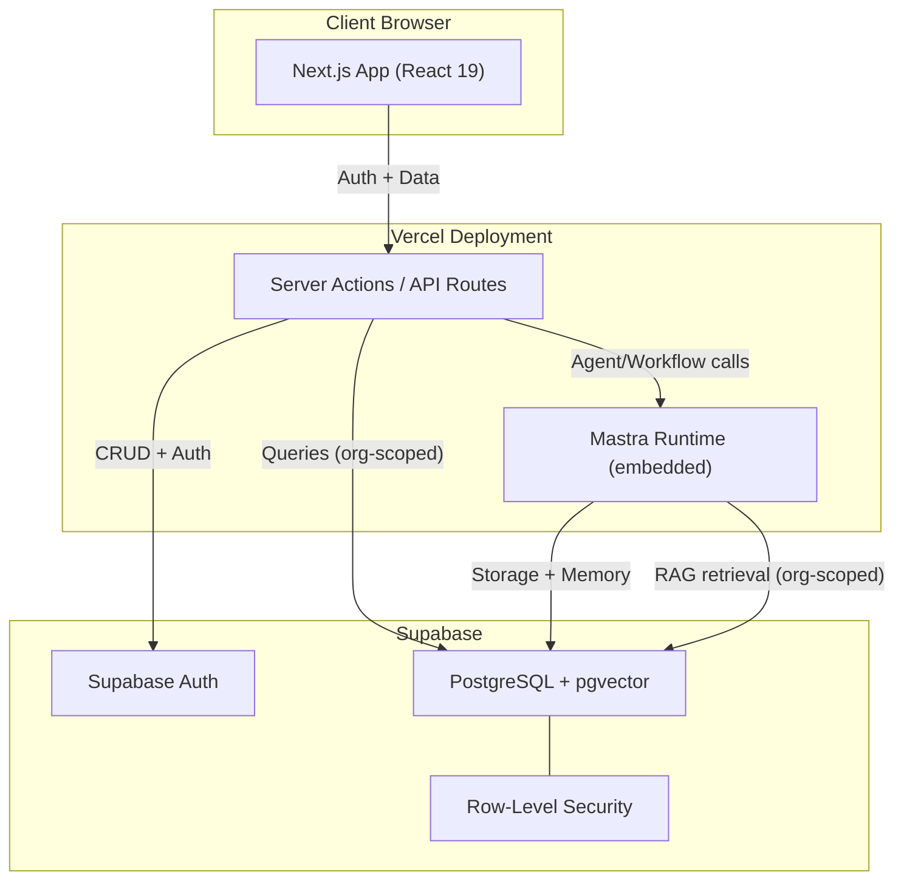
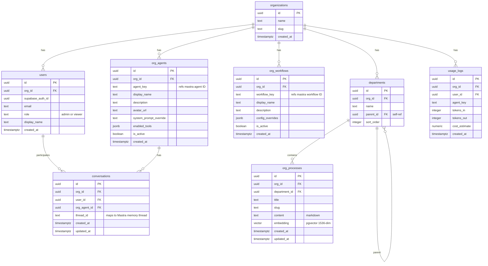
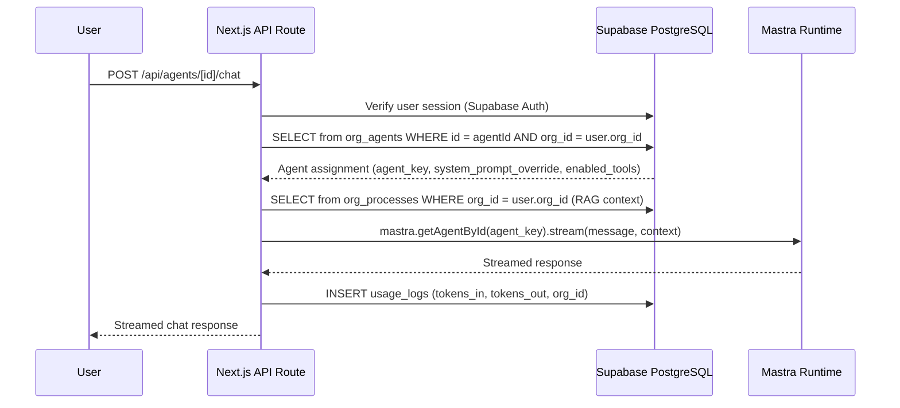

# Jenjco MVP Bootstrap Plan

## Current State

The project at `c:\Users\eliot\jenjco` already has:

- **Next.js 16.1.7** with React 19, pnpm, Tailwind v4, shadcn (25 UI components)
- **Mastra** with a working weather-agent example (LibSQL + DuckDB storage)
- **AI SDK** (`ai@6.0.156`, `@ai-sdk/react@3.0.158`) with chat UI components (`components/ai-elements/`)
- **@xyflow/react** installed (for workflow visualization later)
- **No auth, no Supabase, no multi-tenancy, no @mastra/pg, no @mastra/rag**

## Architecture Overview




## Data Model




## Agent Resolution Flow (Runtime)




---

## Phase 0: Project Housekeeping

Clean up the existing project before building new features.

- **Check** `AGENTS.md`: Check all `src/mastra/`match actual directory structure
- **Fix `tsconfig.json`**: Confirm `target` is `ES2022` (user says already fixed)
- **Create `.env.example`**: List all required env vars without values (`OPENAI_API_KEY`, `ANTHROPIC_API_KEY`, `SUPABASE_URL`, `SUPABASE_ANON_KEY`, `SUPABASE_SERVICE_ROLE_KEY`, `DATABASE_URL`)
- **Fix `.env`**: The file has a corrupted last line (concatenated keys) -- fix it
- **Add `.gitignore` entries**: Ensure `mastra.db`, `mastra-next.duckdb`, `mastra.duckdb`, `.mastra/`, `.env` are ignored

---

## Phase 1: Supabase Setup

### 1a. Supabase Project + Packages

- Create a Supabase project (via dashboard at supabase.com)
- Install packages:

```bash
  pnpm add @supabase/supabase-js @supabase/ssr
  

```

- Add env vars to `.env`: `SUPABASE_URL`, `SUPABASE_ANON_KEY`, `SUPABASE_SERVICE_ROLE_KEY`, `DATABASE_URL` (Postgres connection string for Mastra/Prisma)

### 1b. Supabase Client Utilities

Create two Supabase client helpers:

- `lib/supabase/server.ts` -- Server-side client using `@supabase/ssr` with Next.js cookies
- `lib/supabase/client.ts` -- Browser-side client using `@supabase/ssr`

### 1c. Database Schema (SQL Migration)

Run via Supabase SQL editor or CLI. Create all tables from the data model above:

- `organizations`, `users`, `org_agents`, `org_workflows`, `departments`, `org_processes`, `conversations`, `usage_logs`
- Enable `pgvector` extension: `CREATE EXTENSION IF NOT EXISTS vector;`
- Add `embedding vector(1536)` column to `org_processes`
- Create indexes: `org_id` on all tables, HNSW index on `org_processes.embedding`

### 1d. Row-Level Security Policies

Every table gets RLS enabled with policies scoped by `org_id`:

```sql
-- Example: org_agents
ALTER TABLE org_agents ENABLE ROW LEVEL SECURITY;

CREATE POLICY "Users see own org agents"
ON org_agents FOR SELECT
USING (org_id = (
  SELECT org_id FROM users WHERE supabase_auth_id = auth.uid()
));
```

Service role key bypasses RLS for Jenjco admin operations (seeding agents, onboarding clients).

### 1e. Swap Mastra Storage to PostgreSQL

- Install `@mastra/pg`:

```bash
  pnpm add @mastra/pg
  

```

- Update [mastra/index.ts](mastra/index.ts): Replace `LibSQLStore` + `DuckDBStore` composite with `PostgresStore` using `DATABASE_URL`
- Remove `@mastra/libsql` and `@mastra/duckdb` from dependencies
- Update `next.config.mjs` to remove DuckDB external packages
- Delete local `.db` and `.duckdb` files

### 1f. Seed Demo Data

Create a seed script (`scripts/seed.ts`) using the Supabase service role client to insert:

- 1 demo organization
- 1 admin user, 1 viewer user
- 2 agent assignments (pointing to Mastra agent keys)
- 1 workflow assignment
- 3 departments with 3 process documents
- Department hierarchy for org structure

---

## Phase 2: App Shell + Auth

### 2a. Auth Flow

- **Sign-in page** at `app/(auth)/sign-in/page.tsx`: Email/password login via Supabase Auth (matches wireframe 6)
- **Sign-up page** at `app/(auth)/sign-up/page.tsx`: Registration (invited users only, or open for demo)
- **Auth callback** at `app/(auth)/callback/route.ts`: Handle Supabase OAuth/magic-link redirects
- **Middleware** at `middleware.ts`: Protect all routes under `app/(dashboard)/`; redirect unauthenticated users to sign-in; attach `org_id` to request context

### 2b. App Layout (Dashboard Shell)

Based on wireframe 4 (dashboard), create:

- `app/(dashboard)/layout.tsx`: Authenticated layout with sidebar navigation
- **Sidebar** (`components/sidebar.tsx`): Navigation items matching wireframes:
  - Agents
  - Workflows
  - Processes
  - Org Structure
  - Audit
- **Header**: Welcome message with user name, org context, avatar/settings dropdown
- Use existing shadcn components: `button`, `avatar`, `separator`, `tooltip`, `dropdown-menu`
- Add shadcn components needed: `sidebar`, `sheet` (mobile nav), `skeleton` (loading states)

### 2c. Dashboard Home Page

`app/(dashboard)/page.tsx` matching wireframe 4:

- Welcome header with user's name
- Summary cards: agent count, workflow count, process count (queried from Supabase, org-scoped)
- AAMI score placeholder (static for MVP)
- Token usage chart (last 30 days from `usage_logs`, using a lightweight chart library like recharts or the chart components from shadcn)

### 2d. Auth Context / Hooks

- `hooks/use-user.ts`: Hook that returns current user + org_id from Supabase session
- `lib/auth.ts`: Server-side helper to get authenticated user and org_id from cookies

---

## Phase 3: Agents (Core Feature)

### 3a. Agent List Page

`app/(dashboard)/agents/page.tsx` matching wireframe 1 (left panels):

- **Search bar** at top to filter agents by name
- **Agent cards** listing all agents assigned to the user's org (from `org_agents` table)
- Each card shows: display name, description, active/inactive status, assigned processes 
- Clicking an agent opens the chat view (right panel)
- **"Active Agents" panel**: Shows agents with ongoing conversations

### 3b. Agent Chat Page

`app/(dashboard)/agents/[id]/page.tsx` matching wireframe 1 (right panel):

- Reuse existing `components/ai-elements/` chat components (conversation, message, prompt-input, tool)
- **Key change from current chat**: Instead of hardcoded `agentId: 'weather-agent'`, resolve the agent dynamically:
  1. Fetch the `org_agent` record by ID (verify org_id matches)
  2. Pass `agent_key` to Mastra runtime
  3. Thread ID = `${org_id}-${user_id}-${org_agent_id}`
- Conversation history loaded from Mastra memory (scoped by thread)

### 3c. Agent API Routes

- `app/api/agents/route.ts` (GET): List agents for authenticated user's org
- `app/api/agents/[id]/chat/route.ts` (POST): Stream chat with a specific agent
  - Verify org ownership
  - Resolve Mastra agent by `agent_key`
  - Inject org-specific system prompt override
  - Log usage to `usage_logs`
- `app/api/agents/[id]/chat/route.ts` (GET): Retrieve conversation history

### 3d. Build 2 Demo Agents in Mastra

Replace the weather agent with two business-relevant demo agents:

- **Agent 1: Process Assistant** (`mastra/agents/process-assistant.ts`)
  - Answers questions about the org's business processes
  - Uses RAG to retrieve relevant process docs from `org_processes`
  - Tools: `process-search-tool` (vector query filtered by org_id)
- **Agent 2: Operations Analyst** (`mastra/agents/operations-analyst.ts`)
  - Analyzes operational data, provides summaries and recommendations
  - Could use a data query tool or work with structured data
  - Tools: TBD based on demo scenario
- Register both in [mastra/index.ts](mastra/index.ts)

### 3e. RAG Pipeline for Process Docs

- Install `@mastra/rag`:

```bash
  pnpm add @mastra/rag
  

```

- Create `mastra/tools/process-search-tool.ts`:
  - Vector query tool that searches `org_processes` by embedding similarity
  - **Critical**: Filter by `org_id` in the WHERE clause
  - Uses pgvector via Supabase (`embedding <=> $query_vector`)
- Create `lib/embeddings.ts`:
  - Utility to generate embeddings using `ai` SDK (`embed` from `ai`)
  - Used when process docs are created/updated (Phase 4)
  - Model: `openai/text-embedding-3-small` (1536 dimensions)

---

## Phase 4: Processes (Knowledge Base)

### 4a. Processes List Page

`app/(dashboard)/processes/page.tsx` matching wireframe 7:

- **Left panel**:
  - Search bar + "+" button (create new -- admin only, or Supabase Studio for MVP)
  - Collapsible department sections (Sales, HR, Finance, Operations...)
  - Each section expands to show process items
  - Active/selected process highlighted
- **Right panel**:
  - Process title + action buttons (edit/delete -- admin only)
  - Rendered markdown content (read-only for MVP)
  - Use a markdown renderer (e.g., `react-markdown` or the existing `streamdown` package)

### 4b. Process Detail Page

`app/(dashboard)/processes/[id]/page.tsx`:

- Full markdown render of the process document
- Metadata: department, last updated, created by
- For MVP: read-only view; editing done via Supabase Studio

### 4c. Process API Routes

- `app/api/processes/route.ts` (GET): List processes for user's org, optionally filtered by department
- `app/api/processes/[id]/route.ts` (GET): Single process detail
- `app/api/processes/route.ts` (POST): Create process (admin only) -- generates embedding and stores
- `app/api/processes/[id]/route.ts` (PUT): Update process (admin only) -- re-generates embedding

### 4d. Seed 3 Demo Processes

Create 3 realistic business process documents in markdown:

- Process 1: "Employee Onboarding" (HR department)
- Process 2: "Sales Order Fulfillment" (Sales/Operations department)
- Process 3: "Monthly Financial Close" (Finance department)

Each stored in `org_processes` with pre-generated embeddings.

---

## Phase 5: Workflows

### 5a. Workflows List Page

`app/(dashboard)/workflows/page.tsx` matching wireframe 2 (left panel):

- Search bar + "+" button (future use)
- Grid or list of workflow cards assigned to the org (from `org_workflows`)
- Each card: display name, description, status

### 5b. Workflow Detail / Visualization Page

`app/(dashboard)/workflows/[id]/page.tsx` matching wireframe 2 (right panel):

- **Read-only** React Flow diagram using `@xyflow/react` (already installed)
- Renders the workflow steps as connected nodes
- Action buttons: "Run" (triggers the workflow), "View Logs" (links to audit)
- Workflow steps derived from Mastra workflow definition (fetch step metadata via API)

### 5c. Workflow API Routes

- `app/api/workflows/route.ts` (GET): List workflows for user's org
- `app/api/workflows/[id]/route.ts` (GET): Workflow detail + step metadata
- `app/api/workflows/[id]/run/route.ts` (POST): Trigger a workflow execution
  - Verify org ownership
  - Execute via Mastra runtime
  - Log usage

### 5d. Build 1 Demo Workflow in Mastra

Replace the weather workflow with a business-relevant demo:

- **Workflow: "New Client Onboarding"** (`mastra/workflows/client-onboarding-workflow.ts`)
  - Step 1: Validate client data (input schema)
  - Step 2: Generate welcome email draft (uses agent)
  - Step 3: Create checklist of setup tasks
  - Register in [mastra/index.ts](mastra/index.ts)

---

## Phase 6: Audit / Metrics (Basic)

### 6a. Audit Page

`app/(dashboard)/audit/page.tsx` matching wireframe 3:

- **Left sidebar** with tabs: "Agents" / "Workflows"
- Sub-navigation: Metrics, Traces, Logs
- **Metrics view (default)**:
  - Summary cards: Total conversations, total tokens used, total workflow runs
  - Token usage chart (last 30 days, from `usage_logs`)
  - Agent usage breakdown (which agents used most)
- **Traces view**: List of recent agent/workflow invocations with timestamps, duration, status (from Mastra observability data or `usage_logs`)
- **Logs view**: Scrollable log output (basic for MVP -- could just show recent `usage_logs` entries)

### 6b. Usage Logging Middleware

- Create `lib/usage-logger.ts`: Utility that logs token usage after every agent/workflow invocation
- Called in agent chat API route and workflow run API route
- Writes to `usage_logs` table with `org_id`, `user_id`, `agent_key`, `tokens_in`, `tokens_out`, `cost_estimate`
- Token counts extracted from Mastra/AI SDK response metadata

### 6c. Audit API Routes

- `app/api/audit/metrics/route.ts` (GET): Aggregated metrics for the org (token usage, conversation counts, agent usage breakdown)
- `app/api/audit/traces/route.ts` (GET): Recent invocation traces
- `app/api/audit/logs/route.ts` (GET): Raw usage logs, paginated

---

## Phase 7: Org Structure (Boilerplate)

### 7a. Org Structure Page

`app/(dashboard)/org-structure/page.tsx` matching wireframe 5:

- React Flow diagram using `@xyflow/react`
- Renders org hierarchy from `departments` table (self-referencing `parent_id`)
- Top node: Organization name (or "CEO" placeholder)
- Second level: Departments
- Third level: Jobs/roles (can be static for MVP)
- Edit button (future use -- for MVP, structure is seeded via Supabase Studio)

### 7b. Org Structure API

- `app/api/org-structure/route.ts` (GET): Returns departments + hierarchy for the org
- React Flow nodes/edges computed client-side from the flat department list

---

## File Structure (Target)

```
jenjco/
├── app/
│   ├── (auth)/
│   │   ├── sign-in/page.tsx
│   │   ├── sign-up/page.tsx
│   │   └── callback/route.ts
│   ├── (dashboard)/
│   │   ├── layout.tsx              (sidebar + header shell)
│   │   ├── page.tsx                (dashboard home)
│   │   ├── agents/
│   │   │   ├── page.tsx            (agent list)
│   │   │   └── [id]/page.tsx       (agent chat)
│   │   ├── workflows/
│   │   │   ├── page.tsx            (workflow list)
│   │   │   └── [id]/page.tsx       (workflow detail + viz)
│   │   ├── processes/
│   │   │   ├── page.tsx            (process list + detail split view)
│   │   │   └── [id]/page.tsx       (process full view)
│   │   ├── audit/
│   │   │   └── page.tsx            (metrics, traces, logs)
│   │   └── org-structure/
│   │       └── page.tsx            (react flow diagram)
│   ├── api/
│   │   ├── agents/
│   │   │   ├── route.ts            (list agents)
│   │   │   └── [id]/chat/route.ts  (agent chat stream)
│   │   ├── workflows/
│   │   │   ├── route.ts            (list workflows)
│   │   │   └── [id]/
│   │   │       ├── route.ts        (workflow detail)
│   │   │       └── run/route.ts    (trigger workflow)
│   │   ├── processes/
│   │   │   ├── route.ts            (list/create processes)
│   │   │   └── [id]/route.ts       (get/update process)
│   │   ├── audit/
│   │   │   ├── metrics/route.ts
│   │   │   ├── traces/route.ts
│   │   │   └── logs/route.ts
│   │   └── org-structure/
│   │       └── route.ts
│   ├── globals.css
│   └── layout.tsx                  (root layout, unchanged)
├── components/
│   ├── ai-elements/                (existing, reused)
│   ├── ui/                         (existing shadcn, extended)
│   ├── sidebar.tsx
│   ├── header.tsx
│   ├── theme-provider.tsx          (existing)
│   └── auth-provider.tsx
├── hooks/
│   ├── use-user.ts
│   └── use-agents.ts
├── lib/
│   ├── utils.ts                    (existing)
│   ├── auth.ts                     (server-side auth helper)
│   ├── embeddings.ts               (embedding generation utility)
│   ├── usage-logger.ts             (token usage logging)
│   └── supabase/
│       ├── server.ts               (server Supabase client)
│       ├── client.ts               (browser Supabase client)
│       └── middleware.ts            (auth middleware helper)
├── mastra/
│   ├── index.ts                    (updated: PostgresStore, new agents)
│   ├── agents/
│   │   ├── process-assistant.ts    (demo agent 1)
│   │   └── operations-analyst.ts   (demo agent 2)
│   ├── workflows/
│   │   └── client-onboarding-workflow.ts  (demo workflow)
│   └── tools/
│       ├── process-search-tool.ts  (RAG vector search)
│       └── ...
├── scripts/
│   └── seed.ts                     (seed demo data)
├── middleware.ts                    (Next.js auth middleware)
└── ...config files
```

## New Dependencies to Install

```bash
# Supabase
pnpm add @supabase/supabase-js @supabase/ssr

# Mastra PostgreSQL storage
pnpm add @mastra/pg

# Mastra RAG
pnpm add @mastra/rag

# Markdown rendering (for process docs)
pnpm add react-markdown remark-gfm

# Charts (for audit metrics)
pnpm add recharts

# Remove (replaced by PostgreSQL)
pnpm remove @mastra/libsql @mastra/duckdb
```

## Key Decisions / Constraints

- **Auth**: Supabase Auth with RLS (not NextAuth)
- **Multi-tenancy**: `org_id` on every table, enforced by RLS policies
- **API pattern**: Next.js API routes + Server Actions (no tRPC for MVP)
- **Agent deployment**: Jenjco dev team deploys code; registry table maps agents to orgs
- **Process editing**: Read-only for clients in MVP; Jenjco team edits via Supabase Studio
- **Workflow builder**: Read-only visualization only; no drag-and-drop for MVP
- **Billing**: Deferred post-MVP; usage_logs table lays the foundation
- **Mastra runtime**: Embedded in Next.js (Option A); separate service deferred to post-MVP

